# Import graph

[index](../README.md)

## Folder graph

Edge label = number of import statements crossing folders.

```mermaid
flowchart LR
  d0["js/aria"] -->|1| d1["js"]
  d0["js/aria"] -->|1| d2["js/comms"]
  d0["js/aria"] -->|5| d3["js/corp"]
  d0["js/aria"] -->|3| d4["js/crew"]
  d0["js/aria"] -->|1| d5["js/drones"]
  d0["js/aria"] -->|17| d6["js/economy"]
  d0["js/aria"] -->|14| d7["js/flight"]
  d0["js/aria"] -->|4| d8["js/mission"]
  d0["js/aria"] -->|7| d9["js/npc"]
  d0["js/aria"] -->|1| d10["js/ships"]
  d0["js/aria"] -->|6| d11["js/sim"]
  d0["js/aria"] -->|6| d12["js/station"]
  d0["js/aria"] -->|5| d13["js/world"]
  d14["js/asteroidgen"] -->|1| d15["js/bodygen"]
  d14["js/asteroidgen"] -->|1| d6["js/economy"]
  d14["js/asteroidgen"] -->|1| d13["js/world"]
  d15["js/bodygen"] -->|3| d14["js/asteroidgen"]
  d15["js/bodygen"] -->|1| d6["js/economy"]
  d15["js/bodygen"] -->|1| d13["js/world"]
  d2["js/comms"] -->|1| d16["js/audio"]
  d2["js/comms"] -->|1| d3["js/corp"]
  d2["js/comms"] -->|2| d6["js/economy"]
  d2["js/comms"] -->|2| d7["js/flight"]
  d2["js/comms"] -->|1| d17["js/interior"]
  d2["js/comms"] -->|1| d18["js/net"]
  d2["js/comms"] -->|5| d9["js/npc"]
  d2["js/comms"] -->|1| d11["js/sim"]
  d2["js/comms"] -->|3| d12["js/station"]
  d2["js/comms"] -->|2| d13["js/world"]
  d19["js/console/panels"] -->|3| d0["js/aria"]
  d19["js/console/panels"] -->|2| d15["js/bodygen"]
  d19["js/console/panels"] -->|3| d20["js/careers"]
  d19["js/console/panels"] -->|1| d2["js/comms"]
  d19["js/console/panels"] -->|19| d21["js/console"]
  d19["js/console/panels"] -->|1| d22["js/core"]
  d19["js/console/panels"] -->|10| d3["js/corp"]
  d19["js/console/panels"] -->|27| d4["js/crew"]
  d19["js/console/panels"] -->|4| d5["js/drones"]
  d19["js/console/panels"] -->|10| d6["js/economy"]
  d19["js/console/panels"] -->|11| d7["js/flight"]
  d19["js/console/panels"] -->|1| d23["js/genome"]
  d19["js/console/panels"] -->|2| d17["js/interior"]
  d19["js/console/panels"] -->|6| d8["js/mission"]
  d19["js/console/panels"] -->|2| d18["js/net"]
  d19["js/console/panels"] -->|11| d9["js/npc"]
  d19["js/console/panels"] -->|17| d11["js/sim"]
  d19["js/console/panels"] -->|15| d12["js/station"]
  d19["js/console/panels"] -->|5| d24["js/ui"]
  d19["js/console/panels"] -->|4| d13["js/world"]
  d21["js/console"] -->|1| d16["js/audio"]
  d21["js/console"] -->|1| d2["js/comms"]
  d21["js/console"] -->|6| d19["js/console/panels"]
  d21["js/console"] -->|1| d22["js/core"]
  d21["js/console"] -->|1| d5["js/drones"]
  d21["js/console"] -->|1| d17["js/interior"]
  d21["js/console"] -->|1| d11["js/sim"]
  d21["js/console"] -->|2| d24["js/ui"]
  d21["js/console"] -->|1| d13["js/world"]
  d22["js/core"] -->|1| d1["js"]
  d22["js/core"] -->|1| d4["js/crew"]
  d22["js/core"] -->|1| d13["js/world"]
  d3["js/corp"] -->|3| d4["js/crew"]
  d3["js/corp"] -->|2| d25["js/data"]
  d3["js/corp"] -->|3| d6["js/economy"]
  d3["js/corp"] -->|3| d7["js/flight"]
  d3["js/corp"] -->|6| d9["js/npc"]
  d3["js/corp"] -->|1| d10["js/ships"]
  d3["js/corp"] -->|2| d11["js/sim"]
  d3["js/corp"] -->|8| d12["js/station"]
  d3["js/corp"] -->|1| d13["js/world"]
  d4["js/crew"] -->|7| d20["js/careers"]
  d4["js/crew"] -->|1| d21["js/console"]
  d4["js/crew"] -->|4| d3["js/corp"]
  d4["js/crew"] -->|3| d6["js/economy"]
  d4["js/crew"] -->|3| d7["js/flight"]
  d4["js/crew"] -->|9| d23["js/genome"]
  d4["js/crew"] -->|3| d17["js/interior"]
  d4["js/crew"] -->|1| d8["js/mission"]
  d4["js/crew"] -->|21| d9["js/npc"]
  d4["js/crew"] -->|1| d26["js/robotgen"]
  d4["js/crew"] -->|1| d10["js/ships"]
  d4["js/crew"] -->|16| d11["js/sim"]
  d4["js/crew"] -->|3| d12["js/station"]
  d4["js/crew"] -->|1| d13["js/world"]
  d25["js/data"] -->|1| d13["js/world"]
  d5["js/drones"] -->|2| d2["js/comms"]
  d5["js/drones"] -->|2| d3["js/corp"]
  d5["js/drones"] -->|6| d6["js/economy"]
  d5["js/drones"] -->|3| d7["js/flight"]
  d5["js/drones"] -->|4| d9["js/npc"]
  d5["js/drones"] -->|2| d26["js/robotgen"]
  d5["js/drones"] -->|2| d11["js/sim"]
  d5["js/drones"] -->|3| d12["js/station"]
  d5["js/drones"] -->|8| d13["js/world"]
  d6["js/economy"] -->|1| d15["js/bodygen"]
  d6["js/economy"] -->|1| d20["js/careers"]
  d6["js/economy"] -->|2| d3["js/corp"]
  d6["js/economy"] -->|1| d4["js/crew"]
  d6["js/economy"] -->|2| d25["js/data"]
  d6["js/economy"] -->|6| d7["js/flight"]
  d6["js/economy"] -->|3| d9["js/npc"]
  d6["js/economy"] -->|1| d27["js/shipgen/data"]
  d6["js/economy"] -->|1| d28["js/shipgen/data/catalog"]
  d6["js/economy"] -->|4| d10["js/ships"]
  d6["js/economy"] -->|6| d11["js/sim"]
  d6["js/economy"] -->|4| d12["js/station"]
  d6["js/economy"] -->|2| d13["js/world"]
  d7["js/flight"] -->|3| d0["js/aria"]
  d7["js/flight"] -->|1| d16["js/audio"]
  d7["js/flight"] -->|4| d20["js/careers"]
  d7["js/flight"] -->|1| d22["js/core"]
  d7["js/flight"] -->|2| d3["js/corp"]
  d7["js/flight"] -->|1| d4["js/crew"]
  d7["js/flight"] -->|1| d5["js/drones"]
  d7["js/flight"] -->|6| d6["js/economy"]
  d7["js/flight"] -->|2| d8["js/mission"]
  d7["js/flight"] -->|8| d9["js/npc"]
  d7["js/flight"] -->|4| d11["js/sim"]
  d7["js/flight"] -->|5| d12["js/station"]
  d7["js/flight"] -->|14| d13["js/world"]
  d7["js/flight"] -->|2| d29["js/world/events"]
  d23["js/genome"] -->|1| d4["js/crew"]
  d17["js/interior"] -->|1| d16["js/audio"]
  d17["js/interior"] -->|2| d20["js/careers"]
  d17["js/interior"] -->|1| d22["js/core"]
  d17["js/interior"] -->|1| d3["js/corp"]
  d17["js/interior"] -->|3| d4["js/crew"]
  d17["js/interior"] -->|2| d7["js/flight"]
  d17["js/interior"] -->|3| d9["js/npc"]
  d17["js/interior"] -->|1| d10["js/ships"]
  d17["js/interior"] -->|2| d11["js/sim"]
  d17["js/interior"] -->|1| d12["js/station"]
  d8["js/mission"] -->|3| d0["js/aria"]
  d8["js/mission"] -->|1| d2["js/comms"]
  d8["js/mission"] -->|5| d6["js/economy"]
  d8["js/mission"] -->|5| d7["js/flight"]
  d8["js/mission"] -->|1| d9["js/npc"]
  d8["js/mission"] -->|4| d11["js/sim"]
  d8["js/mission"] -->|3| d12["js/station"]
  d8["js/mission"] -->|2| d13["js/world"]
  d18["js/net"] -->|2| d2["js/comms"]
  d18["js/net"] -->|3| d22["js/core"]
  d18["js/net"] -->|1| d9["js/npc"]
  d18["js/net"] -->|2| d11["js/sim"]
  d18["js/net"] -->|2| d29["js/world/events"]
  d9["js/npc"] -->|2| d20["js/careers"]
  d9["js/npc"] -->|6| d22["js/core"]
  d9["js/npc"] -->|11| d3["js/corp"]
  d9["js/npc"] -->|12| d4["js/crew"]
  d9["js/npc"] -->|1| d25["js/data"]
  d9["js/npc"] -->|8| d6["js/economy"]
  d9["js/npc"] -->|5| d7["js/flight"]
  d9["js/npc"] -->|1| d23["js/genome"]
  d9["js/npc"] -->|2| d17["js/interior"]
  d9["js/npc"] -->|6| d10["js/ships"]
  d9["js/npc"] -->|3| d11["js/sim"]
  d9["js/npc"] -->|1| d30["js/speech"]
  d9["js/npc"] -->|12| d12["js/station"]
  d9["js/npc"] -->|1| d24["js/ui"]
  d9["js/npc"] -->|16| d13["js/world"]
  d9["js/npc"] -->|1| d29["js/world/events"]
  d31["js/render"] -->|1| d0["js/aria"]
  d31["js/render"] -->|12| d14["js/asteroidgen"]
  d31["js/render"] -->|1| d16["js/audio"]
  d31["js/render"] -->|8| d15["js/bodygen"]
  d31["js/render"] -->|4| d22["js/core"]
  d31["js/render"] -->|3| d5["js/drones"]
  d31["js/render"] -->|1| d6["js/economy"]
  d31["js/render"] -->|5| d7["js/flight"]
  d31["js/render"] -->|1| d18["js/net"]
  d31["js/render"] -->|4| d9["js/npc"]
  d31["js/render"] -->|1| d32["js/shipgen"]
  d31["js/render"] -->|6| d10["js/ships"]
  d31["js/render"] -->|2| d11["js/sim"]
  d31["js/render"] -->|3| d12["js/station"]
  d31["js/render"] -->|1| d33["js/stationgen"]
  d31["js/render"] -->|1| d24["js/ui"]
  d31["js/render"] -->|9| d13["js/world"]
  d31["js/render"] -->|6| d29["js/world/events"]
  d26["js/robotgen"] -->|1| d34["js/robotgen/data"]
  d35["js/shipgen/builder"] -->|16| d36["js/shipgen/core"]
  d35["js/shipgen/builder"] -->|19| d27["js/shipgen/data"]
  d35["js/shipgen/builder"] -->|8| d28["js/shipgen/data/catalog"]
  d35["js/shipgen/builder"] -->|8| d37["js/shipgen/prefabs"]
  d27["js/shipgen/data"] -->|1| d36["js/shipgen/core"]
  d27["js/shipgen/data"] -->|1| d28["js/shipgen/data/catalog"]
  d38["js/shipgen/ops"] -->|1| d36["js/shipgen/core"]
  d37["js/shipgen/prefabs"] -->|8| d36["js/shipgen/core"]
  d32["js/shipgen"] -->|2| d35["js/shipgen/builder"]
  d32["js/shipgen"] -->|3| d36["js/shipgen/core"]
  d32["js/shipgen"] -->|15| d27["js/shipgen/data"]
  d32["js/shipgen"] -->|2| d28["js/shipgen/data/catalog"]
  d32["js/shipgen"] -->|4| d38["js/shipgen/ops"]
  d32["js/shipgen"] -->|1| d37["js/shipgen/prefabs"]
  d10["js/ships"] -->|1| d6["js/economy"]
  d10["js/ships"] -->|2| d32["js/shipgen"]
  d10["js/ships"] -->|1| d36["js/shipgen/core"]
  d10["js/ships"] -->|3| d27["js/shipgen/data"]
  d10["js/ships"] -->|1| d28["js/shipgen/data/catalog"]
  d11["js/sim"] -->|1| d0["js/aria"]
  d11["js/sim"] -->|1| d16["js/audio"]
  d11["js/sim"] -->|2| d2["js/comms"]
  d11["js/sim"] -->|3| d22["js/core"]
  d11["js/sim"] -->|4| d3["js/corp"]
  d11["js/sim"] -->|3| d4["js/crew"]
  d11["js/sim"] -->|3| d5["js/drones"]
  d11["js/sim"] -->|9| d6["js/economy"]
  d11["js/sim"] -->|12| d7["js/flight"]
  d11["js/sim"] -->|1| d17["js/interior"]
  d11["js/sim"] -->|9| d9["js/npc"]
  d11["js/sim"] -->|1| d10["js/ships"]
  d11["js/sim"] -->|6| d12["js/station"]
  d11["js/sim"] -->|7| d13["js/world"]
  d11["js/sim"] -->|5| d29["js/world/events"]
  d39["js/stationgen/builder"] -->|4| d40["js/stationgen/core"]
  d39["js/stationgen/builder"] -->|6| d41["js/stationgen/data"]
  d39["js/stationgen/builder"] -->|3| d42["js/stationgen/prefabs"]
  d42["js/stationgen/prefabs"] -->|2| d40["js/stationgen/core"]
  d42["js/stationgen/prefabs"] -->|1| d41["js/stationgen/data"]
  d33["js/stationgen"] -->|6| d39["js/stationgen/builder"]
  d33["js/stationgen"] -->|4| d40["js/stationgen/core"]
  d33["js/stationgen"] -->|13| d41["js/stationgen/data"]
  d33["js/stationgen"] -->|2| d42["js/stationgen/prefabs"]
  d12["js/station"] -->|1| d20["js/careers"]
  d12["js/station"] -->|2| d2["js/comms"]
  d12["js/station"] -->|3| d21["js/console"]
  d12["js/station"] -->|1| d19["js/console/panels"]
  d12["js/station"] -->|10| d3["js/corp"]
  d12["js/station"] -->|6| d4["js/crew"]
  d12["js/station"] -->|3| d5["js/drones"]
  d12["js/station"] -->|10| d6["js/economy"]
  d12["js/station"] -->|4| d7["js/flight"]
  d12["js/station"] -->|1| d23["js/genome"]
  d12["js/station"] -->|6| d9["js/npc"]
  d12["js/station"] -->|2| d10["js/ships"]
  d12["js/station"] -->|9| d11["js/sim"]
  d12["js/station"] -->|1| d33["js/stationgen"]
  d12["js/station"] -->|4| d24["js/ui"]
  d12["js/station"] -->|3| d13["js/world"]
  d24["js/ui"] -->|1| d1["js"]
  d24["js/ui"] -->|2| d0["js/aria"]
  d24["js/ui"] -->|3| d16["js/audio"]
  d24["js/ui"] -->|1| d20["js/careers"]
  d24["js/ui"] -->|3| d2["js/comms"]
  d24["js/ui"] -->|2| d21["js/console"]
  d24["js/ui"] -->|3| d22["js/core"]
  d24["js/ui"] -->|9| d3["js/corp"]
  d24["js/ui"] -->|3| d4["js/crew"]
  d24["js/ui"] -->|12| d6["js/economy"]
  d24["js/ui"] -->|18| d7["js/flight"]
  d24["js/ui"] -->|2| d17["js/interior"]
  d24["js/ui"] -->|4| d8["js/mission"]
  d24["js/ui"] -->|3| d18["js/net"]
  d24["js/ui"] -->|7| d9["js/npc"]
  d24["js/ui"] -->|9| d11["js/sim"]
  d24["js/ui"] -->|11| d12["js/station"]
  d24["js/ui"] -->|6| d13["js/world"]
  d24["js/ui"] -->|2| d29["js/world/events"]
  d29["js/world/events"] -->|5| d14["js/asteroidgen"]
  d29["js/world/events"] -->|2| d15["js/bodygen"]
  d29["js/world/events"] -->|1| d3["js/corp"]
  d29["js/world/events"] -->|1| d4["js/crew"]
  d29["js/world/events"] -->|1| d7["js/flight"]
  d29["js/world/events"] -->|1| d10["js/ships"]
  d29["js/world/events"] -->|1| d11["js/sim"]
  d29["js/world/events"] -->|3| d13["js/world"]
  d13["js/world"] -->|1| d15["js/bodygen"]
  d13["js/world"] -->|1| d25["js/data"]
  d13["js/world"] -->|4| d6["js/economy"]
  d13["js/world"] -->|1| d10["js/ships"]
  d13["js/world"] -->|2| d43["js/vendor/stellar-names"]
  d1["js"] -->|1| d16["js/audio"]
  d1["js"] -->|3| d22["js/core"]
  d1["js"] -->|1| d3["js/corp"]
  d1["js"] -->|1| d4["js/crew"]
  d1["js"] -->|1| d7["js/flight"]
  d1["js"] -->|1| d18["js/net"]
  d1["js"] -->|1| d31["js/render"]
  d1["js"] -->|1| d11["js/sim"]
  d1["js"] -->|1| d24["js/ui"]
  d1["js"] -->|1| d13["js/world"]
```

## Cycles

2 strongly-connected groups. Cycles are legal in ES modules but make top-level evaluation order matter (TDZ).

- (39) [js/aria/aria.js](../files/js/aria/aria.js.md) ⇄ [js/aria/nav.js](../files/js/aria/nav.js.md) ⇄ [js/aria/pilot.js](../files/js/aria/pilot.js.md) ⇄ [js/corp/company.js](../files/js/corp/company.js.md) ⇄ [js/corp/fleet.js](../files/js/corp/fleet.js.md) ⇄ [js/corp/seclevel.js](../files/js/corp/seclevel.js.md) ⇄ [js/crew/bonds.js](../files/js/crew/bonds.js.md) ⇄ [js/crew/children.js](../files/js/crew/children.js.md) ⇄ [js/crew/duties.js](../files/js/crew/duties.js.md) ⇄ [js/crew/family.js](../files/js/crew/family.js.md) ⇄ [js/crew/robots.js](../files/js/crew/robots.js.md) ⇄ [js/crew/roster.js](../files/js/crew/roster.js.md) ⇄ [js/drones/npcdrones.js](../files/js/drones/npcdrones.js.md) ⇄ [js/drones/ops.js](../files/js/drones/ops.js.md) ⇄ [js/economy/chains.js](../files/js/economy/chains.js.md) ⇄ [js/economy/contracts.js](../files/js/economy/contracts.js.md) ⇄ [js/economy/icework.js](../files/js/economy/icework.js.md) ⇄ [js/economy/traderoutes.js](../files/js/economy/traderoutes.js.md) ⇄ [js/economy/upgrades.js](../files/js/economy/upgrades.js.md) ⇄ [js/flight/autopilot.js](../files/js/flight/autopilot.js.md) ⇄ [js/flight/contacts.js](../files/js/flight/contacts.js.md) ⇄ [js/flight/probes.js](../files/js/flight/probes.js.md) ⇄ [js/flight/repair.js](../files/js/flight/repair.js.md) ⇄ [js/flight/turrets.js](../files/js/flight/turrets.js.md) ⇄ [js/interior/boarding.js](../files/js/interior/boarding.js.md) ⇄ [js/mission/detour.js](../files/js/mission/detour.js.md) ⇄ [js/mission/run.js](../files/js/mission/run.js.md) ⇄ [js/mission/script.js](../files/js/mission/script.js.md) ⇄ [js/mission/tradeops.js](../files/js/mission/tradeops.js.md) ⇄ [js/npc/captain.js](../files/js/npc/captain.js.md) ⇄ [js/npc/combat.js](../files/js/npc/combat.js.md) ⇄ [js/npc/crewfx.js](../files/js/npc/crewfx.js.md) ⇄ [js/npc/rogues.js](../files/js/npc/rogues.js.md) ⇄ [js/sim/sim.js](../files/js/sim/sim.js.md) ⇄ [js/station/stafflife.js](../files/js/station/stafflife.js.md) ⇄ [js/station/staffline.js](../files/js/station/staffline.js.md) ⇄ [js/station/stationlife.js](../files/js/station/stationlife.js.md) ⇄ [js/station/stationworks.js](../files/js/station/stationworks.js.md) ⇄ [js/world/events/atmoworks.js](../files/js/world/events/atmoworks.js.md)
- (4) [js/console/console.js](../files/js/console/console.js.md) ⇄ [js/console/panels/work.js](../files/js/console/panels/work.js.md) ⇄ [js/console/search.js](../files/js/console/search.js.md) ⇄ [js/ui/map.js](../files/js/ui/map.js.md)

## External specifiers

- `three` — [js/asteroidgen/addons/Pass.js](../files/js/asteroidgen/addons/Pass.js.md), [js/asteroidgen/blackhole.js](../files/js/asteroidgen/blackhole.js.md), [js/asteroidgen/debris.js](../files/js/asteroidgen/debris.js.md), [js/asteroidgen/fracture.js](../files/js/asteroidgen/fracture.js.md), [js/asteroidgen/generator.js](../files/js/asteroidgen/generator.js.md), [js/render/holefx.js](../files/js/render/holefx.js.md), [js/render/impactfx.js](../files/js/render/impactfx.js.md), [js/render/postfx.js](../files/js/render/postfx.js.md), [js/render/rockfx.js](../files/js/render/rockfx.js.md), [js/render/warpfx.js](../files/js/render/warpfx.js.md), [js/shipgen/builder/StarshipBuilder.js](../files/js/shipgen/builder/StarshipBuilder.js.md), [js/shipgen/builder/details.js](../files/js/shipgen/builder/details.js.md), [js/shipgen/builder/docking.js](../files/js/shipgen/builder/docking.js.md), [js/shipgen/builder/drives.js](../files/js/shipgen/builder/drives.js.md), [js/shipgen/builder/glazing.js](../files/js/shipgen/builder/glazing.js.md), [js/shipgen/builder/hull.js](../files/js/shipgen/builder/hull.js.md), [js/shipgen/builder/placement.js](../files/js/shipgen/builder/placement.js.md), [js/shipgen/builder/weapons.js](../files/js/shipgen/builder/weapons.js.md), [js/shipgen/core/geometry.js](../files/js/shipgen/core/geometry.js.md), [js/shipgen/data/flight.js](../files/js/shipgen/data/flight.js.md), [js/shipgen/generate.js](../files/js/shipgen/generate.js.md), [js/shipgen/ops/fx.js](../files/js/shipgen/ops/fx.js.md), [js/shipgen/ops/ops.js](../files/js/shipgen/ops/ops.js.md), [js/shipgen/prefabs/acs.js](../files/js/shipgen/prefabs/acs.js.md), [js/shipgen/prefabs/docking.js](../files/js/shipgen/prefabs/docking.js.md), [js/shipgen/prefabs/extra.js](../files/js/shipgen/prefabs/extra.js.md), [js/shipgen/prefabs/industrial.js](../files/js/shipgen/prefabs/industrial.js.md), [js/shipgen/prefabs/power.js](../files/js/shipgen/prefabs/power.js.md), [js/shipgen/prefabs/sensors.js](../files/js/shipgen/prefabs/sensors.js.md), [js/shipgen/prefabs/structure.js](../files/js/shipgen/prefabs/structure.js.md), [js/station/stationyard.js](../files/js/station/stationyard.js.md), [js/stationgen/anim.js](../files/js/stationgen/anim.js.md), [js/stationgen/builder/StationBuilder.js](../files/js/stationgen/builder/StationBuilder.js.md), [js/stationgen/builder/frames.js](../files/js/stationgen/builder/frames.js.md), [js/stationgen/builder/hangar.js](../files/js/stationgen/builder/hangar.js.md), [js/stationgen/builder/hull.js](../files/js/stationgen/builder/hull.js.md), [js/stationgen/builder/placement.js](../files/js/stationgen/builder/placement.js.md), [js/stationgen/core/geometry.js](../files/js/stationgen/core/geometry.js.md), [js/stationgen/generate.js](../files/js/stationgen/generate.js.md)
- `three/addons/postprocessing/Pass.js` — [js/asteroidgen/blackhole.js](../files/js/asteroidgen/blackhole.js.md)

## Unresolved (target not in js/)

- [js/drones/droneforge.js](../files/js/drones/droneforge.js.md) L1 → `../../vendor/three.module.min.js` (vendor/three.module.min.js)
- [js/render/attract.js](../files/js/render/attract.js.md) L1 → `../../vendor/three.module.min.js` (vendor/three.module.min.js)
- [js/render/engine.js](../files/js/render/engine.js.md) L1 → `../../vendor/three.module.min.js` (vendor/three.module.min.js)
- [js/ships/shipforge.js](../files/js/ships/shipforge.js.md) L1 → `../../vendor/three.module.min.js` (vendor/three.module.min.js)
- [js/world/textures.js](../files/js/world/textures.js.md) L1 → `../../vendor/three.module.min.js` (vendor/three.module.min.js)

## Dynamic imports

- [js/bodygen/worker.js › ready](../files/js/bodygen/worker.js.md#s-ready) L32 → `‹(await)›` (runtime-resolved)
- [js/core/addon-loader.js › loadAddons](../files/js/core/addon-loader.js.md#s-loadAddons) L18 → `../../addon/${…}/index.js` (runtime-resolved)

## Every edge

- [js/aria/aria.js](../files/js/aria/aria.js.md) → [js/flight/recorder.js](../files/js/flight/recorder.js.md), [js/aria/mind.js](../files/js/aria/mind.js.md), [js/corp/gdb.js](../files/js/corp/gdb.js.md), [js/sim/sim.js](../files/js/sim/sim.js.md), [js/npc/captain.js](../files/js/npc/captain.js.md), [js/comms/chat.js](../files/js/comms/chat.js.md), [js/aria/pilot.js](../files/js/aria/pilot.js.md)
- [js/aria/company.js](../files/js/aria/company.js.md) → [js/aria/mind.js](../files/js/aria/mind.js.md), [js/sim/sim.js](../files/js/sim/sim.js.md), [js/station/stations.js](../files/js/station/stations.js.md), [js/crew/ledger.js](../files/js/crew/ledger.js.md), [js/crew/roster.js](../files/js/crew/roster.js.md), [js/corp/company.js](../files/js/corp/company.js.md), [js/economy/contracts.js](../files/js/economy/contracts.js.md), [js/economy/traderoutes.js](../files/js/economy/traderoutes.js.md), [js/flight/ship.js](../files/js/flight/ship.js.md)
- [js/aria/nav.js](../files/js/aria/nav.js.md) → [js/sim/sim.js](../files/js/sim/sim.js.md), [js/world/bodies.js](../files/js/world/bodies.js.md), [js/station/stations.js](../files/js/station/stations.js.md)
- [js/aria/pilot.js](../files/js/aria/pilot.js.md) → [js/aria/mind.js](../files/js/aria/mind.js.md), [js/sim/sim.js](../files/js/sim/sim.js.md), [js/flight/ship.js](../files/js/flight/ship.js.md), [js/station/stations.js](../files/js/station/stations.js.md), [js/world/bodies.js](../files/js/world/bodies.js.md), [js/flight/turrets.js](../files/js/flight/turrets.js.md), [js/npc/captain.js](../files/js/npc/captain.js.md), [js/flight/autopilot.js](../files/js/flight/autopilot.js.md), [js/mission/run.js](../files/js/mission/run.js.md), [js/mission/script.js](../files/js/mission/script.js.md), [js/flight/repair.js](../files/js/flight/repair.js.md), [js/economy/upgrades.js](../files/js/economy/upgrades.js.md), [js/drones/ops.js](../files/js/drones/ops.js.md), [js/economy/fabricate.js](../files/js/economy/fabricate.js.md), [js/flight/recorder.js](../files/js/flight/recorder.js.md), [js/corp/company.js](../files/js/corp/company.js.md)
- [js/aria/play.js](../files/js/aria/play.js.md) → [js/aria/mind.js](../files/js/aria/mind.js.md), [js/sim/sim.js](../files/js/sim/sim.js.md), [js/station/stations.js](../files/js/station/stations.js.md), [js/flight/ship.js](../files/js/flight/ship.js.md), [js/flight/pilot.js](../files/js/flight/pilot.js.md), [js/economy/materials.js](../files/js/economy/materials.js.md), [js/economy/contracts.js](../files/js/economy/contracts.js.md), [js/economy/traderoutes.js](../files/js/economy/traderoutes.js.md), [js/economy/economy.js](../files/js/economy/economy.js.md), [js/mission/script.js](../files/js/mission/script.js.md), [js/mission/run.js](../files/js/mission/run.js.md), [js/flight/autopilot.js](../files/js/flight/autopilot.js.md), [js/economy/chains.js](../files/js/economy/chains.js.md), [js/version.js](../files/js/version.js.md), [js/economy/economy.js](../files/js/economy/economy.js.md), [js/npc/rogues.js](../files/js/npc/rogues.js.md), [js/npc/traffic.js](../files/js/npc/traffic.js.md), [js/aria/senses.js](../files/js/aria/senses.js.md), [js/aria/nav.js](../files/js/aria/nav.js.md), [js/station/dockwork.js](../files/js/station/dockwork.js.md), [js/aria/company.js](../files/js/aria/company.js.md), [js/corp/company.js](../files/js/corp/company.js.md), [js/crew/ledger.js](../files/js/crew/ledger.js.md), [js/flight/repair.js](../files/js/flight/repair.js.md)
- [js/aria/senses.js](../files/js/aria/senses.js.md) → [js/sim/sim.js](../files/js/sim/sim.js.md), [js/station/stations.js](../files/js/station/stations.js.md), [js/world/bodies.js](../files/js/world/bodies.js.md), [js/world/scale.js](../files/js/world/scale.js.md), [js/economy/economy.js](../files/js/economy/economy.js.md), [js/world/field.js](../files/js/world/field.js.md), [js/flight/turrets.js](../files/js/flight/turrets.js.md), [js/npc/traffic.js](../files/js/npc/traffic.js.md), [js/npc/flow.js](../files/js/npc/flow.js.md), [js/npc/rogues.js](../files/js/npc/rogues.js.md), [js/corp/corps.js](../files/js/corp/corps.js.md), [js/flight/ship.js](../files/js/flight/ship.js.md), [js/flight/repair.js](../files/js/flight/repair.js.md), [js/ships/shipdb.js](../files/js/ships/shipdb.js.md), [js/economy/materials.js](../files/js/economy/materials.js.md), [js/economy/sites.js](../files/js/economy/sites.js.md), [js/economy/contracts.js](../files/js/economy/contracts.js.md), [js/economy/traderoutes.js](../files/js/economy/traderoutes.js.md), [js/economy/chains.js](../files/js/economy/chains.js.md), [js/economy/materials.js](../files/js/economy/materials.js.md)
- [js/asteroidgen/addons/Pass.js](../files/js/asteroidgen/addons/Pass.js.md) → `three`
- [js/asteroidgen/blackhole.js](../files/js/asteroidgen/blackhole.js.md) → `three`, `three/addons/postprocessing/Pass.js`, [js/asteroidgen/debris.js](../files/js/asteroidgen/debris.js.md), [js/asteroidgen/kerr.js](../files/js/asteroidgen/kerr.js.md)
- [js/asteroidgen/debris.js](../files/js/asteroidgen/debris.js.md) → `three`, [js/asteroidgen/rng.js](../files/js/asteroidgen/rng.js.md), [js/asteroidgen/ores.js](../files/js/asteroidgen/ores.js.md)
- [js/asteroidgen/fracture.js](../files/js/asteroidgen/fracture.js.md) → `three`, [js/asteroidgen/rng.js](../files/js/asteroidgen/rng.js.md)
- [js/asteroidgen/generator.js](../files/js/asteroidgen/generator.js.md) → `three`, [js/asteroidgen/ores.js](../files/js/asteroidgen/ores.js.md), [js/asteroidgen/rng.js](../files/js/asteroidgen/rng.js.md), [js/asteroidgen/debris.js](../files/js/asteroidgen/debris.js.md)
- [js/asteroidgen/impact-shaders.js](../files/js/asteroidgen/impact-shaders.js.md) → [js/asteroidgen/fracture.js](../files/js/asteroidgen/fracture.js.md)
- [js/asteroidgen/impact-sim.js](../files/js/asteroidgen/impact-sim.js.md) → [js/asteroidgen/rng.js](../files/js/asteroidgen/rng.js.md)
- [js/asteroidgen/impact.js](../files/js/asteroidgen/impact.js.md) → [js/asteroidgen/rng.js](../files/js/asteroidgen/rng.js.md)
- [js/asteroidgen/ores.js](../files/js/asteroidgen/ores.js.md) → [js/economy/materials.js](../files/js/economy/materials.js.md), [js/world/rockgen.js](../files/js/world/rockgen.js.md), [js/bodygen/classes.js](../files/js/bodygen/classes.js.md)
- [js/asteroidgen/tidal.js](../files/js/asteroidgen/tidal.js.md) → [js/asteroidgen/rng.js](../files/js/asteroidgen/rng.js.md), [js/asteroidgen/kerr.js](../files/js/asteroidgen/kerr.js.md), [js/asteroidgen/debris.js](../files/js/asteroidgen/debris.js.md), [js/asteroidgen/fracture.js](../files/js/asteroidgen/fracture.js.md)
- [js/audio/ambience.js](../files/js/audio/ambience.js.md) → [js/audio/graph.js](../files/js/audio/graph.js.md), [js/audio/voices.js](../files/js/audio/voices.js.md)
- [js/audio/cues.js](../files/js/audio/cues.js.md) → [js/audio/graph.js](../files/js/audio/graph.js.md), [js/audio/voices.js](../files/js/audio/voices.js.md)
- [js/audio/index.js](../files/js/audio/index.js.md) → [js/audio/graph.js](../files/js/audio/graph.js.md), [js/audio/cues.js](../files/js/audio/cues.js.md), [js/audio/ambience.js](../files/js/audio/ambience.js.md), [js/audio/voices.js](../files/js/audio/voices.js.md)
- [js/audio/voices.js](../files/js/audio/voices.js.md) → [js/audio/graph.js](../files/js/audio/graph.js.md)
- [js/bodygen/baked.js](../files/js/bodygen/baked.js.md) → [js/bodygen/classes.js](../files/js/bodygen/classes.js.md)
- [js/bodygen/body.js](../files/js/bodygen/body.js.md) → [js/asteroidgen/generator.js](../files/js/asteroidgen/generator.js.md), [js/bodygen/bake.js](../files/js/bodygen/bake.js.md), [js/bodygen/classes.js](../files/js/bodygen/classes.js.md), [js/world/rockgen.js](../files/js/world/rockgen.js.md), [js/economy/materials.js](../files/js/economy/materials.js.md)
- [js/bodygen/gl.js](../files/js/bodygen/gl.js.md) → [js/asteroidgen/debris.js](../files/js/asteroidgen/debris.js.md), [js/asteroidgen/impact-shaders.js](../files/js/asteroidgen/impact-shaders.js.md)
- [js/bodygen/grower.js](../files/js/bodygen/grower.js.md) → [js/bodygen/body.js](../files/js/bodygen/body.js.md)
- [js/careers/careerEngine.js](../files/js/careers/careerEngine.js.md) → [js/careers/skills.js](../files/js/careers/skills.js.md), [js/careers/complexes.js](../files/js/careers/complexes.js.md)
- [js/careers/index.js](../files/js/careers/index.js.md) → [js/careers/skills.js](../files/js/careers/skills.js.md), [js/careers/complexes.js](../files/js/careers/complexes.js.md), [js/careers/careerEngine.js](../files/js/careers/careerEngine.js.md)
- [js/careers/status.js](../files/js/careers/status.js.md) → [js/careers/complexes.js](../files/js/careers/complexes.js.md)
- [js/comms/call-ui.js](../files/js/comms/call-ui.js.md) → [js/comms/call-session.js](../files/js/comms/call-session.js.md)
- [js/comms/comms.js](../files/js/comms/comms.js.md) → [js/comms/call-session.js](../files/js/comms/call-session.js.md), [js/comms/call-ui.js](../files/js/comms/call-ui.js.md), [js/comms/call-scripts.js](../files/js/comms/call-scripts.js.md), [js/npc/traffic.js](../files/js/npc/traffic.js.md), [js/npc/battles.js](../files/js/npc/battles.js.md), [js/npc/cradle.js](../files/js/npc/cradle.js.md), [js/sim/sim.js](../files/js/sim/sim.js.md), [js/world/bodies.js](../files/js/world/bodies.js.md), [js/station/stations.js](../files/js/station/stations.js.md), [js/flight/turrets.js](../files/js/flight/turrets.js.md), [js/station/stationworks.js](../files/js/station/stationworks.js.md), [js/corp/corps.js](../files/js/corp/corps.js.md), [js/economy/materials.js](../files/js/economy/materials.js.md), [js/economy/economy.js](../files/js/economy/economy.js.md), [js/flight/pilot.js](../files/js/flight/pilot.js.md), [js/interior/boarding.js](../files/js/interior/boarding.js.md), [js/net/net.js](../files/js/net/net.js.md), [js/audio/index.js](../files/js/audio/index.js.md), [js/world/generate.js](../files/js/world/generate.js.md), [js/comms/chat.js](../files/js/comms/chat.js.md), [js/comms/gnn.js](../files/js/comms/gnn.js.md), [js/npc/reports.js](../files/js/npc/reports.js.md), [js/npc/speech.js](../files/js/npc/speech.js.md)
- [js/comms/gnn.js](../files/js/comms/gnn.js.md) → [js/comms/chat.js](../files/js/comms/chat.js.md), [js/station/stations.js](../files/js/station/stations.js.md)
- [js/console/console.js](../files/js/console/console.js.md) → [js/console/kit.js](../files/js/console/kit.js.md), [js/console/kit.js](../files/js/console/kit.js.md), [js/console/search.js](../files/js/console/search.js.md), [js/console/panels/ship.js](../files/js/console/panels/ship.js.md), [js/console/panels/nav.js](../files/js/console/panels/nav.js.md), [js/console/panels/crew.js](../files/js/console/panels/crew.js.md), [js/console/panels/work.js](../files/js/console/panels/work.js.md), [js/console/panels/market.js](../files/js/console/panels/market.js.md), [js/console/panels/corp.js](../files/js/console/panels/corp.js.md), [js/sim/sim.js](../files/js/sim/sim.js.md), [js/audio/index.js](../files/js/audio/index.js.md), [js/world/bodies.js](../files/js/world/bodies.js.md), [js/core/store.js](../files/js/core/store.js.md), [js/comms/gnn.js](../files/js/comms/gnn.js.md), [js/drones/ops.js](../files/js/drones/ops.js.md), [js/ui/map.js](../files/js/ui/map.js.md), [js/interior/interior.js](../files/js/interior/interior.js.md), [js/ui/tutorial.js](../files/js/ui/tutorial.js.md)
- [js/console/panels/aria-core.js](../files/js/console/panels/aria-core.js.md) → [js/console/kit.js](../files/js/console/kit.js.md), [js/aria/mind.js](../files/js/aria/mind.js.md), [js/aria/aria.js](../files/js/aria/aria.js.md)
- [js/console/panels/corp-account.js](../files/js/console/panels/corp-account.js.md) → [js/console/kit.js](../files/js/console/kit.js.md), [js/net/account.js](../files/js/net/account.js.md)
- [js/console/panels/corp-marshal.js](../files/js/console/panels/corp-marshal.js.md) → [js/console/kit.js](../files/js/console/kit.js.md), [js/sim/sim.js](../files/js/sim/sim.js.md), [js/station/stations.js](../files/js/station/stations.js.md), [js/corp/corps.js](../files/js/corp/corps.js.md), [js/npc/bounty.js](../files/js/npc/bounty.js.md), [js/interior/boarding.js](../files/js/interior/boarding.js.md)
- [js/console/panels/corp-town.js](../files/js/console/panels/corp-town.js.md) → [js/console/kit.js](../files/js/console/kit.js.md), [js/sim/sim.js](../files/js/sim/sim.js.md), [js/corp/company.js](../files/js/corp/company.js.md), [js/station/stationlife.js](../files/js/station/stationlife.js.md), [js/npc/cradle.js](../files/js/npc/cradle.js.md), [js/station/stafflife.js](../files/js/station/stafflife.js.md), [js/station/stationclock.js](../files/js/station/stationclock.js.md), [js/station/staffcare.js](../files/js/station/staffcare.js.md), [js/ui/glyphs.js](../files/js/ui/glyphs.js.md), [js/station/staffline.js](../files/js/station/staffline.js.md)
- [js/console/panels/corp.js](../files/js/console/panels/corp.js.md) → [js/console/kit.js](../files/js/console/kit.js.md), [js/console/panels/corp-marshal.js](../files/js/console/panels/corp-marshal.js.md), [js/console/panels/corp-account.js](../files/js/console/panels/corp-account.js.md), [js/net/account.js](../files/js/net/account.js.md), [js/npc/bounty.js](../files/js/npc/bounty.js.md), [js/flight/pilot.js](../files/js/flight/pilot.js.md), [js/careers/effects.js](../files/js/careers/effects.js.md), [js/careers/index.js](../files/js/careers/index.js.md), [js/crew/races.js](../files/js/crew/races.js.md), [js/corp/corps.js](../files/js/corp/corps.js.md), [js/ui/glyphs.js](../files/js/ui/glyphs.js.md), [js/sim/sim.js](../files/js/sim/sim.js.md), [js/station/stations.js](../files/js/station/stations.js.md), [js/corp/company.js](../files/js/corp/company.js.md), [js/economy/contracts.js](../files/js/economy/contracts.js.md), [js/ui/boardview.js](../files/js/ui/boardview.js.md), [js/comms/gnn.js](../files/js/comms/gnn.js.md), [js/sim/sim.js](../files/js/sim/sim.js.md), [js/console/panels/corp-town.js](../files/js/console/panels/corp-town.js.md), [js/station/staffline.js](../files/js/station/staffline.js.md)
- [js/console/panels/crew-brig.js](../files/js/console/panels/crew-brig.js.md) → [js/console/kit.js](../files/js/console/kit.js.md), [js/sim/sim.js](../files/js/sim/sim.js.md), [js/crew/ledger.js](../files/js/crew/ledger.js.md), [js/interior/boarding.js](../files/js/interior/boarding.js.md), [js/corp/corps.js](../files/js/corp/corps.js.md), [js/crew/captive.js](../files/js/crew/captive.js.md), [js/npc/bounty.js](../files/js/npc/bounty.js.md)
- [js/console/panels/crew-gdb.js](../files/js/console/panels/crew-gdb.js.md) → [js/console/kit.js](../files/js/console/kit.js.md), [js/sim/sim.js](../files/js/sim/sim.js.md), [js/station/stations.js](../files/js/station/stations.js.md), [js/npc/traffic.js](../files/js/npc/traffic.js.md), [js/npc/cradle.js](../files/js/npc/cradle.js.md), [js/corp/gdb.js](../files/js/corp/gdb.js.md)
- [js/console/panels/crew-gene.js](../files/js/console/panels/crew-gene.js.md) → [js/console/kit.js](../files/js/console/kit.js.md), [js/crew/ledger.js](../files/js/crew/ledger.js.md), [js/sim/sim.js](../files/js/sim/sim.js.md), [js/npc/cradle.js](../files/js/npc/cradle.js.md), [js/genome/spacer.js](../files/js/genome/spacer.js.md), [js/crew/deckmind.js](../files/js/crew/deckmind.js.md), [js/crew/deckacts.js](../files/js/crew/deckacts.js.md), [js/crew/journal.js](../files/js/crew/journal.js.md), [js/crew/learn.js](../files/js/crew/learn.js.md), [js/crew/heritage.js](../files/js/crew/heritage.js.md), [js/careers/skills.js](../files/js/careers/skills.js.md), [js/crew/orders.js](../files/js/crew/orders.js.md), [js/crew/deckmind.js](../files/js/crew/deckmind.js.md)
- [js/console/panels/crew-sky.js](../files/js/console/panels/crew-sky.js.md) → [js/console/kit.js](../files/js/console/kit.js.md), [js/sim/sim.js](../files/js/sim/sim.js.md), [js/npc/traffic.js](../files/js/npc/traffic.js.md), [js/npc/npccrew.js](../files/js/npc/npccrew.js.md), [js/console/kit.js](../files/js/console/kit.js.md)
- [js/console/panels/crew.js](../files/js/console/panels/crew.js.md) → [js/console/kit.js](../files/js/console/kit.js.md), [js/crew/ledger.js](../files/js/crew/ledger.js.md), [js/crew/children.js](../files/js/crew/children.js.md), [js/crew/childtalk.js](../files/js/crew/childtalk.js.md), [js/crew/tiers.js](../files/js/crew/tiers.js.md), [js/sim/sim.js](../files/js/sim/sim.js.md), [js/crew/family.js](../files/js/crew/family.js.md), [js/crew/romance.js](../files/js/crew/romance.js.md), [js/npc/cradle.js](../files/js/npc/cradle.js.md), [js/npc/captain.js](../files/js/npc/captain.js.md), [js/corp/company.js](../files/js/corp/company.js.md), [js/crew/roster.js](../files/js/crew/roster.js.md), [js/crew/bonds.js](../files/js/crew/bonds.js.md), [js/crew/duties.js](../files/js/crew/duties.js.md), [js/crew/talkview.js](../files/js/crew/talkview.js.md), [js/crew/journal.js](../files/js/crew/journal.js.md), [js/crew/talk.js](../files/js/crew/talk.js.md), [js/console/panels/crew-gene.js](../files/js/console/panels/crew-gene.js.md), [js/console/panels/crew-sky.js](../files/js/console/panels/crew-sky.js.md), [js/console/panels/crew-brig.js](../files/js/console/panels/crew-brig.js.md), [js/console/panels/crew-gdb.js](../files/js/console/panels/crew-gdb.js.md), [js/crew/hooks.js](../files/js/crew/hooks.js.md), [js/crew/beats.js](../files/js/crew/beats.js.md)
- [js/console/panels/market.js](../files/js/console/panels/market.js.md) → [js/console/kit.js](../files/js/console/kit.js.md), [js/economy/materials.js](../files/js/economy/materials.js.md), [js/economy/icework.js](../files/js/economy/icework.js.md), [js/flight/ship.js](../files/js/flight/ship.js.md), [js/sim/sim.js](../files/js/sim/sim.js.md), [js/station/stations.js](../files/js/station/stations.js.md), [js/station/refityard.js](../files/js/station/refityard.js.md), [js/economy/upgrades.js](../files/js/economy/upgrades.js.md), [js/economy/traderoutes.js](../files/js/economy/traderoutes.js.md), [js/mission/script.js](../files/js/mission/script.js.md), [js/mission/run.js](../files/js/mission/run.js.md), [js/sim/sim.js](../files/js/sim/sim.js.md)
- [js/console/panels/nav.js](../files/js/console/panels/nav.js.md) → [js/console/panels/aria-core.js](../files/js/console/panels/aria-core.js.md), [js/console/kit.js](../files/js/console/kit.js.md), [js/world/bodies.js](../files/js/world/bodies.js.md), [js/flight/turrets.js](../files/js/flight/turrets.js.md), [js/flight/ship.js](../files/js/flight/ship.js.md), [js/world/anchors.js](../files/js/world/anchors.js.md), [js/sim/sim.js](../files/js/sim/sim.js.md), [js/mission/run.js](../files/js/mission/run.js.md), [js/mission/script.js](../files/js/mission/script.js.md), [js/flight/autopilot.js](../files/js/flight/autopilot.js.md), [js/world/field.js](../files/js/world/field.js.md), [js/bodygen/body.js](../files/js/bodygen/body.js.md), [js/bodygen/classes.js](../files/js/bodygen/classes.js.md), [js/flight/ship.js](../files/js/flight/ship.js.md), [js/aria/aria.js](../files/js/aria/aria.js.md), [js/station/stations.js](../files/js/station/stations.js.md), [js/economy/materials.js](../files/js/economy/materials.js.md)
- [js/console/panels/ship.js](../files/js/console/panels/ship.js.md) → [js/console/kit.js](../files/js/console/kit.js.md), [js/flight/turrets.js](../files/js/flight/turrets.js.md), [js/flight/rig.js](../files/js/flight/rig.js.md), [js/ui/charts.js](../files/js/ui/charts.js.md), [js/flight/ship.js](../files/js/flight/ship.js.md), [js/sim/sim.js](../files/js/sim/sim.js.md), [js/core/store.js](../files/js/core/store.js.md), [js/flight/autopilot.js](../files/js/flight/autopilot.js.md), [js/crew/duties.js](../files/js/crew/duties.js.md), [js/crew/robots.js](../files/js/crew/robots.js.md), [js/economy/upgrades.js](../files/js/economy/upgrades.js.md)
- [js/console/panels/work-drones.js](../files/js/console/panels/work-drones.js.md) → [js/console/kit.js](../files/js/console/kit.js.md), [js/sim/sim.js](../files/js/sim/sim.js.md), [js/station/stations.js](../files/js/station/stations.js.md), [js/drones/roles.js](../files/js/drones/roles.js.md), [js/drones/ops.js](../files/js/drones/ops.js.md), [js/corp/company.js](../files/js/corp/company.js.md), [js/drones/board.js](../files/js/drones/board.js.md), [js/drones/npcdrones.js](../files/js/drones/npcdrones.js.md), [js/economy/insurance.js](../files/js/economy/insurance.js.md)
- [js/console/panels/work-fleet.js](../files/js/console/panels/work-fleet.js.md) → [js/console/kit.js](../files/js/console/kit.js.md), [js/sim/sim.js](../files/js/sim/sim.js.md), [js/station/stations.js](../files/js/station/stations.js.md), [js/corp/company.js](../files/js/corp/company.js.md), [js/corp/fleet.js](../files/js/corp/fleet.js.md)
- [js/console/panels/work-tape.js](../files/js/console/panels/work-tape.js.md) → [js/console/kit.js](../files/js/console/kit.js.md), [js/sim/sim.js](../files/js/sim/sim.js.md), [js/flight/recorder.js](../files/js/flight/recorder.js.md)
- [js/console/panels/work.js](../files/js/console/panels/work.js.md) → [js/console/kit.js](../files/js/console/kit.js.md), [js/sim/sim.js](../files/js/sim/sim.js.md), [js/world/bodies.js](../files/js/world/bodies.js.md), [js/station/stations.js](../files/js/station/stations.js.md), [js/economy/upgrades.js](../files/js/economy/upgrades.js.md), [js/mission/script.js](../files/js/mission/script.js.md), [js/mission/run.js](../files/js/mission/run.js.md), [js/console/panels/work-drones.js](../files/js/console/panels/work-drones.js.md), [js/console/panels/work-fleet.js](../files/js/console/panels/work-fleet.js.md), [js/console/panels/work-tape.js](../files/js/console/panels/work-tape.js.md), [js/economy/fabricate.js](../files/js/economy/fabricate.js.md), [js/console/console.js](../files/js/console/console.js.md), [js/ui/tutorial.js](../files/js/ui/tutorial.js.md)
- [js/console/search.js](../files/js/console/search.js.md) → [js/console/console.js](../files/js/console/console.js.md)
- [js/core/addon-loader.js](../files/js/core/addon-loader.js.md) → [js/crew/hooks.js](../files/js/crew/hooks.js.md)
- [js/core/boot.js](../files/js/core/boot.js.md) → [js/version.js](../files/js/version.js.md)
- [js/core/store.js](../files/js/core/store.js.md) → [js/world/bodies.js](../files/js/world/bodies.js.md)
- [js/corp/company.js](../files/js/corp/company.js.md) → [js/sim/sim.js](../files/js/sim/sim.js.md), [js/flight/pilot.js](../files/js/flight/pilot.js.md), [js/station/stations.js](../files/js/station/stations.js.md), [js/corp/corps.js](../files/js/corp/corps.js.md), [js/crew/ledger.js](../files/js/crew/ledger.js.md), [js/npc/cradle.js](../files/js/npc/cradle.js.md), [js/station/stationlife.js](../files/js/station/stationlife.js.md), [js/station/staffline.js](../files/js/station/staffline.js.md), [js/station/stafflife.js](../files/js/station/stafflife.js.md), [js/station/stationclock.js](../files/js/station/stationclock.js.md)
- [js/corp/corps.js](../files/js/corp/corps.js.md) → [js/economy/materials.js](../files/js/economy/materials.js.md), [js/station/stations.js](../files/js/station/stations.js.md), [js/data/factions.js](../files/js/data/factions.js.md)
- [js/corp/fleet.js](../files/js/corp/fleet.js.md) → [js/sim/sim.js](../files/js/sim/sim.js.md), [js/station/stations.js](../files/js/station/stations.js.md), [js/npc/traffic.js](../files/js/npc/traffic.js.md), [js/economy/economy.js](../files/js/economy/economy.js.md), [js/corp/company.js](../files/js/corp/company.js.md), [js/ships/shipdb.js](../files/js/ships/shipdb.js.md), [js/economy/shipcost.js](../files/js/economy/shipcost.js.md), [js/crew/ledger.js](../files/js/crew/ledger.js.md), [js/npc/cradle.js](../files/js/npc/cradle.js.md), [js/corp/corps.js](../files/js/corp/corps.js.md)
- [js/corp/gdb.js](../files/js/corp/gdb.js.md) → [js/npc/cradle.js](../files/js/npc/cradle.js.md), [js/world/names.js](../files/js/world/names.js.md), [js/data/lexicons.js](../files/js/data/lexicons.js.md), [js/crew/races.js](../files/js/crew/races.js.md)
- [js/corp/seclevel.js](../files/js/corp/seclevel.js.md) → [js/flight/pilot.js](../files/js/flight/pilot.js.md), [js/npc/security.js](../files/js/npc/security.js.md), [js/npc/traffic.js](../files/js/npc/traffic.js.md), [js/corp/corps.js](../files/js/corp/corps.js.md), [js/station/stations.js](../files/js/station/stations.js.md), [js/flight/turrets.js](../files/js/flight/turrets.js.md)
- [js/crew/beats.js](../files/js/crew/beats.js.md) → [js/crew/ledger.js](../files/js/crew/ledger.js.md), [js/crew/family.js](../files/js/crew/family.js.md), [js/crew/bonds.js](../files/js/crew/bonds.js.md), [js/crew/romance.js](../files/js/crew/romance.js.md), [js/crew/hooks.js](../files/js/crew/hooks.js.md), [js/sim/sim.js](../files/js/sim/sim.js.md)
- [js/crew/bonds.js](../files/js/crew/bonds.js.md) → [js/crew/ledger.js](../files/js/crew/ledger.js.md), [js/crew/family.js](../files/js/crew/family.js.md), [js/npc/cradle.js](../files/js/npc/cradle.js.md)
- [js/crew/captive.js](../files/js/crew/captive.js.md) → [js/sim/sim.js](../files/js/sim/sim.js.md), [js/crew/ledger.js](../files/js/crew/ledger.js.md), [js/npc/cradle.js](../files/js/npc/cradle.js.md), [js/interior/boarding.js](../files/js/interior/boarding.js.md), [js/corp/corps.js](../files/js/corp/corps.js.md), [js/crew/deckmind.js](../files/js/crew/deckmind.js.md), [js/genome/spacer.js](../files/js/genome/spacer.js.md)
- [js/crew/children.js](../files/js/crew/children.js.md) → [js/npc/cradle.js](../files/js/npc/cradle.js.md), [js/genome/spacer.js](../files/js/genome/spacer.js.md), [js/crew/family.js](../files/js/crew/family.js.md), [js/crew/ledger.js](../files/js/crew/ledger.js.md), [js/sim/sim.js](../files/js/sim/sim.js.md), [js/careers/complexes.js](../files/js/careers/complexes.js.md), [js/crew/voice.js](../files/js/crew/voice.js.md)
- [js/crew/childtalk.js](../files/js/crew/childtalk.js.md) → [js/npc/cradle.js](../files/js/npc/cradle.js.md), [js/crew/family.js](../files/js/crew/family.js.md), [js/crew/ledger.js](../files/js/crew/ledger.js.md), [js/sim/sim.js](../files/js/sim/sim.js.md), [js/station/stations.js](../files/js/station/stations.js.md), [js/careers/complexes.js](../files/js/careers/complexes.js.md), [js/crew/children.js](../files/js/crew/children.js.md)
- [js/crew/deckacts.js](../files/js/crew/deckacts.js.md) → [js/crew/ledger.js](../files/js/crew/ledger.js.md), [js/npc/cradle.js](../files/js/npc/cradle.js.md), [js/crew/family.js](../files/js/crew/family.js.md), [js/crew/bonds.js](../files/js/crew/bonds.js.md), [js/crew/journal.js](../files/js/crew/journal.js.md), [js/crew/heritage.js](../files/js/crew/heritage.js.md), [js/sim/sim.js](../files/js/sim/sim.js.md), [js/crew/romance.js](../files/js/crew/romance.js.md)
- [js/crew/deckgraph.js](../files/js/crew/deckgraph.js.md) → [js/genome/behavior-graph.js](../files/js/genome/behavior-graph.js.md), [js/crew/learn.js](../files/js/crew/learn.js.md)
- [js/crew/deckmind.js](../files/js/crew/deckmind.js.md) → [js/genome/behavior-graph.js](../files/js/genome/behavior-graph.js.md), [js/crew/deckgraph.js](../files/js/crew/deckgraph.js.md), [js/genome/spacer.js](../files/js/genome/spacer.js.md), [js/crew/ledger.js](../files/js/crew/ledger.js.md), [js/npc/cradle.js](../files/js/npc/cradle.js.md), [js/crew/family.js](../files/js/crew/family.js.md), [js/crew/bonds.js](../files/js/crew/bonds.js.md), [js/sim/sim.js](../files/js/sim/sim.js.md), [js/npc/captain.js](../files/js/npc/captain.js.md), [js/crew/hull.js](../files/js/crew/hull.js.md), [js/crew/journal.js](../files/js/crew/journal.js.md), [js/crew/learn.js](../files/js/crew/learn.js.md), [js/crew/romance.js](../files/js/crew/romance.js.md), [js/crew/deckacts.js](../files/js/crew/deckacts.js.md), [js/crew/deckacts.js](../files/js/crew/deckacts.js.md)
- [js/crew/duties.js](../files/js/crew/duties.js.md) → [js/crew/ledger.js](../files/js/crew/ledger.js.md), [js/sim/sim.js](../files/js/sim/sim.js.md), [js/flight/ship.js](../files/js/flight/ship.js.md), [js/crew/family.js](../files/js/crew/family.js.md), [js/economy/upgrades.js](../files/js/economy/upgrades.js.md), [js/npc/crewfx.js](../files/js/npc/crewfx.js.md), [js/crew/roster.js](../files/js/crew/roster.js.md)
- [js/crew/family.js](../files/js/crew/family.js.md) → [js/crew/ledger.js](../files/js/crew/ledger.js.md), [js/npc/cradle.js](../files/js/npc/cradle.js.md), [js/corp/gdb.js](../files/js/corp/gdb.js.md), [js/world/names.js](../files/js/world/names.js.md), [js/genome/spacer.js](../files/js/genome/spacer.js.md), [js/crew/heritage.js](../files/js/crew/heritage.js.md), [js/careers/complexes.js](../files/js/careers/complexes.js.md), [js/crew/children.js](../files/js/crew/children.js.md), [js/station/stationlife.js](../files/js/station/stationlife.js.md), [js/crew/voice.js](../files/js/crew/voice.js.md), [js/corp/company.js](../files/js/corp/company.js.md), [js/sim/sim.js](../files/js/sim/sim.js.md), [js/flight/pilot.js](../files/js/flight/pilot.js.md), [js/crew/races.js](../files/js/crew/races.js.md), [js/station/stations.js](../files/js/station/stations.js.md)
- [js/crew/heritage.js](../files/js/crew/heritage.js.md) → [js/careers/complexes.js](../files/js/careers/complexes.js.md), [js/npc/cradle.js](../files/js/npc/cradle.js.md)
- [js/crew/hull.js](../files/js/crew/hull.js.md) → [js/crew/ledger.js](../files/js/crew/ledger.js.md), [js/sim/sim.js](../files/js/sim/sim.js.md), [js/crew/duties.js](../files/js/crew/duties.js.md), [js/crew/roster.js](../files/js/crew/roster.js.md), [js/npc/crewfx.js](../files/js/npc/crewfx.js.md), [js/interior/boarding.js](../files/js/interior/boarding.js.md), [js/crew/family.js](../files/js/crew/family.js.md)
- [js/crew/journal.js](../files/js/crew/journal.js.md) → [js/npc/cradle.js](../files/js/npc/cradle.js.md)
- [js/crew/learn.js](../files/js/crew/learn.js.md) → [js/npc/brain.js](../files/js/npc/brain.js.md), [js/npc/cradle.js](../files/js/npc/cradle.js.md)
- [js/crew/ledger.js](../files/js/crew/ledger.js.md) → [js/careers/complexes.js](../files/js/careers/complexes.js.md), [js/flight/ship.js](../files/js/flight/ship.js.md), [js/npc/cradle.js](../files/js/npc/cradle.js.md), [js/corp/gdb.js](../files/js/corp/gdb.js.md), [js/genome/spacer.js](../files/js/genome/spacer.js.md)
- [js/crew/orders.js](../files/js/crew/orders.js.md) → [js/crew/ledger.js](../files/js/crew/ledger.js.md), [js/sim/sim.js](../files/js/sim/sim.js.md), [js/crew/deckmind.js](../files/js/crew/deckmind.js.md), [js/crew/deckacts.js](../files/js/crew/deckacts.js.md), [js/crew/bonds.js](../files/js/crew/bonds.js.md), [js/crew/deckgraph.js](../files/js/crew/deckgraph.js.md), [js/crew/hull.js](../files/js/crew/hull.js.md), [js/crew/family.js](../files/js/crew/family.js.md), [js/crew/learn.js](../files/js/crew/learn.js.md), [js/careers/skills.js](../files/js/careers/skills.js.md)
- [js/crew/races.js](../files/js/crew/races.js.md) → [js/careers/effects.js](../files/js/careers/effects.js.md)
- [js/crew/robots.js](../files/js/crew/robots.js.md) → [js/robotgen/spec.js](../files/js/robotgen/spec.js.md), [js/crew/ledger.js](../files/js/crew/ledger.js.md), [js/sim/sim.js](../files/js/sim/sim.js.md), [js/economy/upgrades.js](../files/js/economy/upgrades.js.md), [js/crew/duties.js](../files/js/crew/duties.js.md), [js/npc/cradle.js](../files/js/npc/cradle.js.md)
- [js/crew/robotyard.js](../files/js/crew/robotyard.js.md) → [js/sim/sim.js](../files/js/sim/sim.js.md), [js/crew/ledger.js](../files/js/crew/ledger.js.md), [js/console/kit.js](../files/js/console/kit.js.md), [js/crew/robots.js](../files/js/crew/robots.js.md)
- [js/crew/romance.js](../files/js/crew/romance.js.md) → [js/crew/ledger.js](../files/js/crew/ledger.js.md), [js/npc/cradle.js](../files/js/npc/cradle.js.md), [js/crew/family.js](../files/js/crew/family.js.md), [js/crew/bonds.js](../files/js/crew/bonds.js.md), [js/genome/spacer.js](../files/js/genome/spacer.js.md), [js/sim/sim.js](../files/js/sim/sim.js.md), [js/crew/hooks.js](../files/js/crew/hooks.js.md)
- [js/crew/roster.js](../files/js/crew/roster.js.md) → [js/crew/ledger.js](../files/js/crew/ledger.js.md), [js/sim/sim.js](../files/js/sim/sim.js.md), [js/ships/shipdb.js](../files/js/ships/shipdb.js.md), [js/interior/deckplan.js](../files/js/interior/deckplan.js.md), [js/npc/crewfx.js](../files/js/npc/crewfx.js.md), [js/npc/cradle.js](../files/js/npc/cradle.js.md), [js/crew/bonds.js](../files/js/crew/bonds.js.md), [js/crew/family.js](../files/js/crew/family.js.md)
- [js/crew/talk-threads.js](../files/js/crew/talk-threads.js.md) → [js/crew/ledger.js](../files/js/crew/ledger.js.md), [js/sim/sim.js](../files/js/sim/sim.js.md), [js/crew/duties.js](../files/js/crew/duties.js.md), [js/economy/materials.js](../files/js/economy/materials.js.md)
- [js/crew/talk-trees.js](../files/js/crew/talk-trees.js.md) → [js/crew/ledger.js](../files/js/crew/ledger.js.md), [js/crew/family.js](../files/js/crew/family.js.md), [js/crew/duties.js](../files/js/crew/duties.js.md), [js/crew/roster.js](../files/js/crew/roster.js.md), [js/crew/voice.js](../files/js/crew/voice.js.md)
- [js/crew/talk-wants.js](../files/js/crew/talk-wants.js.md) → [js/crew/ledger.js](../files/js/crew/ledger.js.md), [js/crew/duties.js](../files/js/crew/duties.js.md), [js/crew/journal.js](../files/js/crew/journal.js.md), [js/genome/spacer.js](../files/js/genome/spacer.js.md)
- [js/crew/talk.js](../files/js/crew/talk.js.md) → [js/crew/ledger.js](../files/js/crew/ledger.js.md), [js/crew/family.js](../files/js/crew/family.js.md), [js/npc/cradle.js](../files/js/npc/cradle.js.md), [js/sim/sim.js](../files/js/sim/sim.js.md), [js/mission/run.js](../files/js/mission/run.js.md), [js/crew/bonds.js](../files/js/crew/bonds.js.md), [js/crew/roster.js](../files/js/crew/roster.js.md), [js/crew/talk-trees.js](../files/js/crew/talk-trees.js.md), [js/crew/talk-wants.js](../files/js/crew/talk-wants.js.md), [js/crew/talk-threads.js](../files/js/crew/talk-threads.js.md), [js/crew/hooks.js](../files/js/crew/hooks.js.md), [js/crew/duties.js](../files/js/crew/duties.js.md), [js/crew/voice.js](../files/js/crew/voice.js.md), [js/crew/tiers.js](../files/js/crew/tiers.js.md)
- [js/crew/talkview.js](../files/js/crew/talkview.js.md) → [js/crew/ledger.js](../files/js/crew/ledger.js.md), [js/crew/family.js](../files/js/crew/family.js.md), [js/npc/cradle.js](../files/js/npc/cradle.js.md), [js/crew/races.js](../files/js/crew/races.js.md), [js/crew/talk.js](../files/js/crew/talk.js.md), [js/crew/beats.js](../files/js/crew/beats.js.md)
- [js/crew/tiers.js](../files/js/crew/tiers.js.md) → [js/crew/ledger.js](../files/js/crew/ledger.js.md), [js/crew/family.js](../files/js/crew/family.js.md), [js/crew/romance.js](../files/js/crew/romance.js.md), [js/crew/family.js](../files/js/crew/family.js.md)
- [js/crew/voice.js](../files/js/crew/voice.js.md) → [js/crew/voice-bank.js](../files/js/crew/voice-bank.js.md)
- [js/data/lexicons.js](../files/js/data/lexicons.js.md) → [js/world/naming.js](../files/js/world/naming.js.md)
- [js/drones/board.js](../files/js/drones/board.js.md) → [js/station/stations.js](../files/js/station/stations.js.md), [js/economy/economy.js](../files/js/economy/economy.js.md), [js/economy/materials.js](../files/js/economy/materials.js.md)
- [js/drones/droneforge.js](../files/js/drones/droneforge.js.md) → `../../vendor/three.module.min.js`, [js/robotgen/build.js](../files/js/robotgen/build.js.md), [js/drones/dronespec.js](../files/js/drones/dronespec.js.md), [js/drones/dronespec.js](../files/js/drones/dronespec.js.md)
- [js/drones/dronespec.js](../files/js/drones/dronespec.js.md) → [js/robotgen/spec.js](../files/js/robotgen/spec.js.md), [js/drones/roles.js](../files/js/drones/roles.js.md)
- [js/drones/npcdrones.js](../files/js/drones/npcdrones.js.md) → [js/sim/sim.js](../files/js/sim/sim.js.md), [js/station/stations.js](../files/js/station/stations.js.md), [js/corp/corps.js](../files/js/corp/corps.js.md), [js/world/bodies.js](../files/js/world/bodies.js.md), [js/world/field.js](../files/js/world/field.js.md), [js/economy/economy.js](../files/js/economy/economy.js.md), [js/world/generate.js](../files/js/world/generate.js.md), [js/npc/bay.js](../files/js/npc/bay.js.md), [js/drones/roles.js](../files/js/drones/roles.js.md), [js/drones/board.js](../files/js/drones/board.js.md)
- [js/drones/ops.js](../files/js/drones/ops.js.md) → [js/sim/sim.js](../files/js/sim/sim.js.md), [js/world/anchors.js](../files/js/world/anchors.js.md), [js/flight/ship.js](../files/js/flight/ship.js.md), [js/station/stations.js](../files/js/station/stations.js.md), [js/world/field.js](../files/js/world/field.js.md), [js/world/bodies.js](../files/js/world/bodies.js.md), [js/world/debris.js](../files/js/world/debris.js.md), [js/world/hulks.js](../files/js/world/hulks.js.md), [js/npc/traffic.js](../files/js/npc/traffic.js.md), [js/npc/battles.js](../files/js/npc/battles.js.md), [js/flight/turrets.js](../files/js/flight/turrets.js.md), [js/economy/economy.js](../files/js/economy/economy.js.md), [js/economy/materials.js](../files/js/economy/materials.js.md), [js/drones/dronespec.js](../files/js/drones/dronespec.js.md), [js/flight/probes.js](../files/js/flight/probes.js.md), [js/comms/chat.js](../files/js/comms/chat.js.md), [js/comms/gnn.js](../files/js/comms/gnn.js.md), [js/npc/bay.js](../files/js/npc/bay.js.md), [js/drones/roles.js](../files/js/drones/roles.js.md), [js/corp/company.js](../files/js/corp/company.js.md), [js/drones/board.js](../files/js/drones/board.js.md), [js/economy/insurance.js](../files/js/economy/insurance.js.md)
- [js/economy/chains.js](../files/js/economy/chains.js.md) → [js/data/chains.js](../files/js/data/chains.js.md), [js/station/stations.js](../files/js/station/stations.js.md), [js/sim/sim.js](../files/js/sim/sim.js.md)
- [js/economy/contracts.js](../files/js/economy/contracts.js.md) → [js/sim/salvage.js](../files/js/sim/salvage.js.md), [js/sim/sim.js](../files/js/sim/sim.js.md), [js/station/stations.js](../files/js/station/stations.js.md), [js/corp/corps.js](../files/js/corp/corps.js.md), [js/data/factions.js](../files/js/data/factions.js.md), [js/economy/economy.js](../files/js/economy/economy.js.md), [js/economy/materials.js](../files/js/economy/materials.js.md), [js/npc/traffic.js](../files/js/npc/traffic.js.md), [js/npc/flow.js](../files/js/npc/flow.js.md), [js/npc/rogues.js](../files/js/npc/rogues.js.md), [js/world/generate.js](../files/js/world/generate.js.md), [js/flight/ship.js](../files/js/flight/ship.js.md), [js/ships/shipdb.js](../files/js/ships/shipdb.js.md), [js/corp/company.js](../files/js/corp/company.js.md), [js/flight/pilot.js](../files/js/flight/pilot.js.md), [js/world/bodies.js](../files/js/world/bodies.js.md), [js/economy/sites.js](../files/js/economy/sites.js.md), [js/economy/chains.js](../files/js/economy/chains.js.md), [js/station/dockwork.js](../files/js/station/dockwork.js.md)
- [js/economy/economy.js](../files/js/economy/economy.js.md) → [js/economy/materials.js](../files/js/economy/materials.js.md)
- [js/economy/fabricate.js](../files/js/economy/fabricate.js.md) → [js/economy/materials.js](../files/js/economy/materials.js.md)
- [js/economy/icework.js](../files/js/economy/icework.js.md) → [js/sim/sim.js](../files/js/sim/sim.js.md), [js/flight/ship.js](../files/js/flight/ship.js.md), [js/ships/shipdb.js](../files/js/ships/shipdb.js.md), [js/crew/ledger.js](../files/js/crew/ledger.js.md), [js/economy/materials.js](../files/js/economy/materials.js.md)
- [js/economy/shipcost.js](../files/js/economy/shipcost.js.md) → [js/ships/hullspec.js](../files/js/ships/hullspec.js.md), [js/shipgen/data/bom.js](../files/js/shipgen/data/bom.js.md), [js/shipgen/data/catalog/index.js](../files/js/shipgen/data/catalog/index.js.md), [js/economy/materials.js](../files/js/economy/materials.js.md)
- [js/economy/sites.js](../files/js/economy/sites.js.md) → [js/bodygen/classes.js](../files/js/bodygen/classes.js.md), [js/economy/materials.js](../files/js/economy/materials.js.md)
- [js/economy/traderoutes.js](../files/js/economy/traderoutes.js.md) → [js/sim/sim.js](../files/js/sim/sim.js.md), [js/station/stations.js](../files/js/station/stations.js.md), [js/flight/ship.js](../files/js/flight/ship.js.md), [js/economy/materials.js](../files/js/economy/materials.js.md), [js/economy/contracts.js](../files/js/economy/contracts.js.md)
- [js/economy/upgrades.js](../files/js/economy/upgrades.js.md) → [js/sim/sim.js](../files/js/sim/sim.js.md), [js/ships/shipdb.js](../files/js/ships/shipdb.js.md), [js/flight/pilot.js](../files/js/flight/pilot.js.md), [js/flight/ship.js](../files/js/flight/ship.js.md), [js/careers/effects.js](../files/js/careers/effects.js.md)
- [js/flight/autopilot.js](../files/js/flight/autopilot.js.md) → [js/sim/sim.js](../files/js/sim/sim.js.md), [js/flight/avoid.js](../files/js/flight/avoid.js.md), [js/core/input.js](../files/js/core/input.js.md), [js/flight/ship.js](../files/js/flight/ship.js.md), [js/flight/ship.js](../files/js/flight/ship.js.md), [js/npc/captain.js](../files/js/npc/captain.js.md), [js/world/bodies.js](../files/js/world/bodies.js.md), [js/station/stations.js](../files/js/station/stations.js.md), [js/npc/lanes.js](../files/js/npc/lanes.js.md), [js/station/stationworks.js](../files/js/station/stationworks.js.md), [js/world/field.js](../files/js/world/field.js.md), [js/flight/turrets.js](../files/js/flight/turrets.js.md), [js/aria/aria.js](../files/js/aria/aria.js.md), [js/mission/script.js](../files/js/mission/script.js.md), [js/mission/run.js](../files/js/mission/run.js.md), [js/economy/contracts.js](../files/js/economy/contracts.js.md), [js/economy/materials.js](../files/js/economy/materials.js.md)
- [js/flight/avoid.js](../files/js/flight/avoid.js.md) → [js/world/bodies.js](../files/js/world/bodies.js.md), [js/world/field.js](../files/js/world/field.js.md), [js/station/stations.js](../files/js/station/stations.js.md), [js/world/scale.js](../files/js/world/scale.js.md), [js/world/events/holes.js](../files/js/world/events/holes.js.md)
- [js/flight/contacts.js](../files/js/flight/contacts.js.md) → [js/sim/sim.js](../files/js/sim/sim.js.md), [js/npc/traffic.js](../files/js/npc/traffic.js.md), [js/npc/flow.js](../files/js/npc/flow.js.md), [js/flight/probes.js](../files/js/flight/probes.js.md), [js/flight/ship.js](../files/js/flight/ship.js.md), [js/flight/ship.js](../files/js/flight/ship.js.md)
- [js/flight/pilot.js](../files/js/flight/pilot.js.md) → [js/careers/index.js](../files/js/careers/index.js.md), [js/careers/effects.js](../files/js/careers/effects.js.md), [js/careers/status.js](../files/js/careers/status.js.md), [js/crew/races.js](../files/js/crew/races.js.md), [js/corp/corps.js](../files/js/corp/corps.js.md)
- [js/flight/probes.js](../files/js/flight/probes.js.md) → [js/world/bodies.js](../files/js/world/bodies.js.md), [js/world/field.js](../files/js/world/field.js.md), [js/npc/traffic.js](../files/js/npc/traffic.js.md), [js/npc/flow.js](../files/js/npc/flow.js.md), [js/station/stations.js](../files/js/station/stations.js.md), [js/sim/sim.js](../files/js/sim/sim.js.md), [js/audio/index.js](../files/js/audio/index.js.md), [js/flight/ship.js](../files/js/flight/ship.js.md)
- [js/flight/recorder.js](../files/js/flight/recorder.js.md) → [js/aria/mind.js](../files/js/aria/mind.js.md)
- [js/flight/repair.js](../files/js/flight/repair.js.md) → [js/sim/sim.js](../files/js/sim/sim.js.md), [js/economy/materials.js](../files/js/economy/materials.js.md), [js/corp/corps.js](../files/js/corp/corps.js.md), [js/economy/upgrades.js](../files/js/economy/upgrades.js.md), [js/station/stations.js](../files/js/station/stations.js.md)
- [js/flight/rig.js](../files/js/flight/rig.js.md) → [js/world/debris.js](../files/js/world/debris.js.md), [js/world/hulks.js](../files/js/world/hulks.js.md), [js/flight/ship.js](../files/js/flight/ship.js.md)
- [js/flight/ship.js](../files/js/flight/ship.js.md) → [js/careers/effects.js](../files/js/careers/effects.js.md), [js/economy/materials.js](../files/js/economy/materials.js.md), [js/world/bodies.js](../files/js/world/bodies.js.md), [js/world/events/holes.js](../files/js/world/events/holes.js.md), [js/flight/defence.js](../files/js/flight/defence.js.md)
- [js/flight/turrets.js](../files/js/flight/turrets.js.md) → [js/flight/ship.js](../files/js/flight/ship.js.md), [js/world/field.js](../files/js/world/field.js.md), [js/world/debris.js](../files/js/world/debris.js.md), [js/economy/materials.js](../files/js/economy/materials.js.md), [js/world/bodies.js](../files/js/world/bodies.js.md), [js/world/generate.js](../files/js/world/generate.js.md), [js/npc/traffic.js](../files/js/npc/traffic.js.md), [js/drones/npcdrones.js](../files/js/drones/npcdrones.js.md), [js/npc/battles.js](../files/js/npc/battles.js.md), [js/aria/aria.js](../files/js/aria/aria.js.md)
- [js/genome/context.js](../files/js/genome/context.js.md) → [js/genome/genome-256.js](../files/js/genome/genome-256.js.md)
- [js/genome/spacer.js](../files/js/genome/spacer.js.md) → [js/genome/genome-256.js](../files/js/genome/genome-256.js.md), [js/genome/context.js](../files/js/genome/context.js.md), [js/crew/races.js](../files/js/crew/races.js.md)
- [js/interior/boarding.js](../files/js/interior/boarding.js.md) → [js/sim/sim.js](../files/js/sim/sim.js.md), [js/flight/ship.js](../files/js/flight/ship.js.md), [js/crew/ledger.js](../files/js/crew/ledger.js.md), [js/npc/cradle.js](../files/js/npc/cradle.js.md), [js/corp/gdb.js](../files/js/corp/gdb.js.md)
- [js/interior/deckplan.js](../files/js/interior/deckplan.js.md) → [js/careers/complexes.js](../files/js/careers/complexes.js.md), [js/careers/complexes.js](../files/js/careers/complexes.js.md)
- [js/interior/interior.js](../files/js/interior/interior.js.md) → [js/sim/sim.js](../files/js/sim/sim.js.md), [js/audio/index.js](../files/js/audio/index.js.md), [js/core/input.js](../files/js/core/input.js.md), [js/crew/ledger.js](../files/js/crew/ledger.js.md), [js/crew/talkview.js](../files/js/crew/talkview.js.md), [js/ships/shipdb.js](../files/js/ships/shipdb.js.md), [js/flight/turrets.js](../files/js/flight/turrets.js.md), [js/station/stations.js](../files/js/station/stations.js.md), [js/interior/deckplan.js](../files/js/interior/deckplan.js.md), [js/npc/captain.js](../files/js/npc/captain.js.md), [js/npc/crewfx.js](../files/js/npc/crewfx.js.md), [js/interior/boarding.js](../files/js/interior/boarding.js.md)
- [js/main.js](../files/js/main.js.md) → [js/core/store.js](../files/js/core/store.js.md), [js/audio/index.js](../files/js/audio/index.js.md), [js/world/bodies.js](../files/js/world/bodies.js.md), [js/ui/hud.js](../files/js/ui/hud.js.md), [js/render/engine.js](../files/js/render/engine.js.md), [js/crew/deckmind.js](../files/js/crew/deckmind.js.md), [js/core/addon-loader.js](../files/js/core/addon-loader.js.md), [js/core/boot.js](../files/js/core/boot.js.md), [js/net/account.js](../files/js/net/account.js.md), [js/corp/company.js](../files/js/corp/company.js.md), [js/sim/sim.js](../files/js/sim/sim.js.md), [js/flight/pilot.js](../files/js/flight/pilot.js.md)
- [js/mission/detour.js](../files/js/mission/detour.js.md) → [js/sim/sim.js](../files/js/sim/sim.js.md), [js/aria/nav.js](../files/js/aria/nav.js.md)
- [js/mission/run.js](../files/js/mission/run.js.md) → [js/aria/mind.js](../files/js/aria/mind.js.md), [js/sim/sim.js](../files/js/sim/sim.js.md), [js/flight/ship.js](../files/js/flight/ship.js.md), [js/flight/ship.js](../files/js/flight/ship.js.md), [js/world/bodies.js](../files/js/world/bodies.js.md), [js/station/stations.js](../files/js/station/stations.js.md), [js/station/stationworks.js](../files/js/station/stationworks.js.md), [js/world/field.js](../files/js/world/field.js.md), [js/economy/sites.js](../files/js/economy/sites.js.md), [js/npc/captain.js](../files/js/npc/captain.js.md), [js/comms/chat.js](../files/js/comms/chat.js.md), [js/economy/upgrades.js](../files/js/economy/upgrades.js.md), [js/mission/tradeops.js](../files/js/mission/tradeops.js.md), [js/mission/detour.js](../files/js/mission/detour.js.md), [js/mission/script.js](../files/js/mission/script.js.md), [js/flight/autopilot.js](../files/js/flight/autopilot.js.md)
- [js/mission/script.js](../files/js/mission/script.js.md) → [js/sim/sim.js](../files/js/sim/sim.js.md), [js/flight/ship.js](../files/js/flight/ship.js.md), [js/economy/upgrades.js](../files/js/economy/upgrades.js.md)
- [js/mission/tradeops.js](../files/js/mission/tradeops.js.md) → [js/aria/mind.js](../files/js/aria/mind.js.md), [js/sim/sim.js](../files/js/sim/sim.js.md), [js/flight/ship.js](../files/js/flight/ship.js.md), [js/station/stations.js](../files/js/station/stations.js.md), [js/economy/traderoutes.js](../files/js/economy/traderoutes.js.md), [js/economy/contracts.js](../files/js/economy/contracts.js.md)
- [js/net/account.js](../files/js/net/account.js.md) → [js/core/profile.js](../files/js/core/profile.js.md), [js/core/store.js](../files/js/core/store.js.md), [js/comms/gnn.js](../files/js/comms/gnn.js.md)
- [js/net/net.js](../files/js/net/net.js.md) → [js/sim/sim.js](../files/js/sim/sim.js.md), [js/core/store.js](../files/js/core/store.js.md)
- [js/net/worldsync.js](../files/js/net/worldsync.js.md) → [js/comms/gnn.js](../files/js/comms/gnn.js.md), [js/net/net.js](../files/js/net/net.js.md), [js/sim/sim.js](../files/js/sim/sim.js.md), [js/world/events/holes.js](../files/js/world/events/holes.js.md), [js/world/events/impactors.js](../files/js/world/events/impactors.js.md), [js/npc/traffic.js](../files/js/npc/traffic.js.md)
- [js/npc/battles.js](../files/js/npc/battles.js.md) → [js/corp/corps.js](../files/js/corp/corps.js.md), [js/world/generate.js](../files/js/world/generate.js.md), [js/npc/traffic.js](../files/js/npc/traffic.js.md), [js/world/debris.js](../files/js/world/debris.js.md), [js/world/hulks.js](../files/js/world/hulks.js.md), [js/station/stations.js](../files/js/station/stations.js.md), [js/world/bodies.js](../files/js/world/bodies.js.md)
- [js/npc/bay.js](../files/js/npc/bay.js.md) → [js/npc/lanes.js](../files/js/npc/lanes.js.md)
- [js/npc/bounty.js](../files/js/npc/bounty.js.md) → [js/sim/sim.js](../files/js/sim/sim.js.md), [js/station/stations.js](../files/js/station/stations.js.md), [js/npc/cradle.js](../files/js/npc/cradle.js.md), [js/corp/gdb.js](../files/js/corp/gdb.js.md), [js/corp/corps.js](../files/js/corp/corps.js.md), [js/crew/ledger.js](../files/js/crew/ledger.js.md), [js/interior/boarding.js](../files/js/interior/boarding.js.md), [js/crew/deckmind.js](../files/js/crew/deckmind.js.md)
- [js/npc/captain.js](../files/js/npc/captain.js.md) → [js/sim/sim.js](../files/js/sim/sim.js.md), [js/station/stationworks.js](../files/js/station/stationworks.js.md), [js/station/stations.js](../files/js/station/stations.js.md), [js/core/input.js](../files/js/core/input.js.md), [js/flight/turrets.js](../files/js/flight/turrets.js.md), [js/station/stations.js](../files/js/station/stations.js.md), [js/world/bodies.js](../files/js/world/bodies.js.md), [js/world/field.js](../files/js/world/field.js.md), [js/economy/icework.js](../files/js/economy/icework.js.md), [js/world/events/impactors.js](../files/js/world/events/impactors.js.md), [js/flight/ship.js](../files/js/flight/ship.js.md), [js/corp/corps.js](../files/js/corp/corps.js.md), [js/crew/ledger.js](../files/js/crew/ledger.js.md), [js/npc/cradle.js](../files/js/npc/cradle.js.md), [js/npc/brain.js](../files/js/npc/brain.js.md)
- [js/npc/combat.js](../files/js/npc/combat.js.md) → [js/npc/traffic.js](../files/js/npc/traffic.js.md), [js/npc/flight.js](../files/js/npc/flight.js.md), [js/flight/turrets.js](../files/js/flight/turrets.js.md), [js/corp/corps.js](../files/js/corp/corps.js.md), [js/npc/security.js](../files/js/npc/security.js.md), [js/core/perf.js](../files/js/core/perf.js.md)
- [js/npc/cradle.js](../files/js/npc/cradle.js.md) → [js/careers/complexes.js](../files/js/careers/complexes.js.md), [js/crew/races.js](../files/js/crew/races.js.md), [js/world/names.js](../files/js/world/names.js.md), [js/data/lexicons.js](../files/js/data/lexicons.js.md), [js/genome/spacer.js](../files/js/genome/spacer.js.md)
- [js/npc/crewfx.js](../files/js/npc/crewfx.js.md) → [js/crew/ledger.js](../files/js/crew/ledger.js.md), [js/interior/deckplan.js](../files/js/interior/deckplan.js.md), [js/ships/shipdb.js](../files/js/ships/shipdb.js.md), [js/flight/pilot.js](../files/js/flight/pilot.js.md), [js/careers/effects.js](../files/js/careers/effects.js.md), [js/crew/bonds.js](../files/js/crew/bonds.js.md), [js/crew/duties.js](../files/js/crew/duties.js.md)
- [js/npc/flight.js](../files/js/npc/flight.js.md) → [js/ships/shipdb.js](../files/js/ships/shipdb.js.md), [js/flight/defence.js](../files/js/flight/defence.js.md)
- [js/npc/flow.js](../files/js/npc/flow.js.md) → [js/world/generate.js](../files/js/world/generate.js.md), [js/core/perf.js](../files/js/core/perf.js.md), [js/station/stations.js](../files/js/station/stations.js.md), [js/npc/lanes.js](../files/js/npc/lanes.js.md), [js/npc/traffic.js](../files/js/npc/traffic.js.md), [js/npc/bay.js](../files/js/npc/bay.js.md), [js/economy/materials.js](../files/js/economy/materials.js.md), [js/ships/shipdb.js](../files/js/ships/shipdb.js.md), [js/economy/economy.js](../files/js/economy/economy.js.md)
- [js/npc/ground.js](../files/js/npc/ground.js.md) → [js/npc/traffic.js](../files/js/npc/traffic.js.md), [js/npc/flow.js](../files/js/npc/flow.js.md), [js/npc/security.js](../files/js/npc/security.js.md), [js/npc/battles.js](../files/js/npc/battles.js.md), [js/npc/rogues.js](../files/js/npc/rogues.js.md), [js/station/stations.js](../files/js/station/stations.js.md), [js/world/bodies.js](../files/js/world/bodies.js.md), [js/world/field.js](../files/js/world/field.js.md), [js/economy/materials.js](../files/js/economy/materials.js.md)
- [js/npc/npccrew.js](../files/js/npc/npccrew.js.md) → [js/npc/traffic.js](../files/js/npc/traffic.js.md), [js/npc/battles.js](../files/js/npc/battles.js.md), [js/npc/flow.js](../files/js/npc/flow.js.md), [js/npc/cradle.js](../files/js/npc/cradle.js.md), [js/corp/gdb.js](../files/js/corp/gdb.js.md), [js/ships/shipdb.js](../files/js/ships/shipdb.js.md), [js/sim/sim.js](../files/js/sim/sim.js.md), [js/crew/ledger.js](../files/js/crew/ledger.js.md), [js/crew/hull.js](../files/js/crew/hull.js.md), [js/crew/deckmind.js](../files/js/crew/deckmind.js.md), [js/crew/journal.js](../files/js/crew/journal.js.md)
- [js/npc/reports.js](../files/js/npc/reports.js.md) → [js/npc/traffic.js](../files/js/npc/traffic.js.md), [js/economy/materials.js](../files/js/economy/materials.js.md), [js/npc/ground.js](../files/js/npc/ground.js.md)
- [js/npc/rogues.js](../files/js/npc/rogues.js.md) → [js/world/generate.js](../files/js/world/generate.js.md), [js/station/stations.js](../files/js/station/stations.js.md), [js/world/bodies.js](../files/js/world/bodies.js.md), [js/npc/traffic.js](../files/js/npc/traffic.js.md), [js/npc/flight.js](../files/js/npc/flight.js.md), [js/station/stationworks.js](../files/js/station/stationworks.js.md), [js/core/perf.js](../files/js/core/perf.js.md)
- [js/npc/security.js](../files/js/npc/security.js.md) → [js/station/stations.js](../files/js/station/stations.js.md), [js/npc/traffic.js](../files/js/npc/traffic.js.md), [js/corp/corps.js](../files/js/corp/corps.js.md), [js/npc/flight.js](../files/js/npc/flight.js.md), [js/core/perf.js](../files/js/core/perf.js.md)
- [js/npc/speech.js](../files/js/npc/speech.js.md) → [js/speech/npc-speech.js](../files/js/speech/npc-speech.js.md), [js/npc/traffic.js](../files/js/npc/traffic.js.md), [js/npc/flow.js](../files/js/npc/flow.js.md), [js/station/stations.js](../files/js/station/stations.js.md), [js/corp/corps.js](../files/js/corp/corps.js.md), [js/ships/shipdb.js](../files/js/ships/shipdb.js.md), [js/economy/materials.js](../files/js/economy/materials.js.md), [js/world/bodies.js](../files/js/world/bodies.js.md), [js/crew/races.js](../files/js/crew/races.js.md), [js/world/names.js](../files/js/world/names.js.md), [js/corp/gdb.js](../files/js/corp/gdb.js.md), [js/npc/cradle.js](../files/js/npc/cradle.js.md), [js/ui/glyphs.js](../files/js/ui/glyphs.js.md), [js/npc/reports.js](../files/js/npc/reports.js.md), [js/npc/ground.js](../files/js/npc/ground.js.md), [js/npc/chat.js](../files/js/npc/chat.js.md)
- [js/npc/traffic.js](../files/js/npc/traffic.js.md) → [js/corp/corps.js](../files/js/corp/corps.js.md), [js/npc/cradle.js](../files/js/npc/cradle.js.md), [js/corp/gdb.js](../files/js/corp/gdb.js.md), [js/world/generate.js](../files/js/world/generate.js.md), [js/world/bodies.js](../files/js/world/bodies.js.md), [js/station/stations.js](../files/js/station/stations.js.md), [js/ships/shipdb.js](../files/js/ships/shipdb.js.md), [js/npc/lanes.js](../files/js/npc/lanes.js.md), [js/economy/economy.js](../files/js/economy/economy.js.md), [js/npc/flight.js](../files/js/npc/flight.js.md), [js/core/perf.js](../files/js/core/perf.js.md), [js/npc/bay.js](../files/js/npc/bay.js.md), [js/economy/insurance.js](../files/js/economy/insurance.js.md)
- [js/render/attract.js](../files/js/render/attract.js.md) → `../../vendor/three.module.min.js`, [js/world/bodies.js](../files/js/world/bodies.js.md), [js/sim/sim.js](../files/js/sim/sim.js.md), [js/ships/shipforge.js](../files/js/ships/shipforge.js.md), [js/ships/shipdb.js](../files/js/ships/shipdb.js.md)
- [js/render/engine.js](../files/js/render/engine.js.md) → `../../vendor/three.module.min.js`, [js/world/bodies.js](../files/js/world/bodies.js.md), [js/world/scale.js](../files/js/world/scale.js.md), [js/world/textures.js](../files/js/world/textures.js.md), [js/world/rockgen.js](../files/js/world/rockgen.js.md), [js/bodygen/body.js](../files/js/bodygen/body.js.md), [js/bodygen/classes.js](../files/js/bodygen/classes.js.md), [js/bodygen/baked.js](../files/js/bodygen/baked.js.md), [js/bodygen/grower.js](../files/js/bodygen/grower.js.md), [js/render/rockfx.js](../files/js/render/rockfx.js.md), [js/render/impactfx.js](../files/js/render/impactfx.js.md), [js/render/holefx.js](../files/js/render/holefx.js.md), [js/world/events/holes.js](../files/js/world/events/holes.js.md), [js/sim/sim.js](../files/js/sim/sim.js.md), [js/core/input.js](../files/js/core/input.js.md), [js/render/attract.js](../files/js/render/attract.js.md), [js/audio/index.js](../files/js/audio/index.js.md), [js/flight/ship.js](../files/js/flight/ship.js.md), [js/ships/shipforge.js](../files/js/ships/shipforge.js.md), [js/drones/droneforge.js](../files/js/drones/droneforge.js.md), [js/flight/probes.js](../files/js/flight/probes.js.md), [js/drones/ops.js](../files/js/drones/ops.js.md), [js/drones/npcdrones.js](../files/js/drones/npcdrones.js.md), [js/ships/shipdb.js](../files/js/ships/shipdb.js.md), [js/world/field.js](../files/js/world/field.js.md), [js/flight/turrets.js](../files/js/flight/turrets.js.md), [js/npc/lanes.js](../files/js/npc/lanes.js.md), [js/station/stationyard.js](../files/js/station/stationyard.js.md), [js/station/stationworks.js](../files/js/station/stationworks.js.md), [js/stationgen/anim.js](../files/js/stationgen/anim.js.md), [js/core/perf.js](../files/js/core/perf.js.md), [js/flight/contacts.js](../files/js/flight/contacts.js.md), [js/render/postfx.js](../files/js/render/postfx.js.md), [js/render/warpfx.js](../files/js/render/warpfx.js.md), [js/npc/flow.js](../files/js/npc/flow.js.md), [js/render/hullpool.js](../files/js/render/hullpool.js.md), [js/npc/battles.js](../files/js/npc/battles.js.md), [js/npc/traffic.js](../files/js/npc/traffic.js.md), [js/net/worldsync.js](../files/js/net/worldsync.js.md), [js/world/debris.js](../files/js/world/debris.js.md), [js/world/hulks.js](../files/js/world/hulks.js.md), [js/flight/rig.js](../files/js/flight/rig.js.md), [js/world/events/cataclysm.js](../files/js/world/events/cataclysm.js.md), [js/ui/tutorial.js](../files/js/ui/tutorial.js.md), [js/world/events/impactors.js](../files/js/world/events/impactors.js.md), [js/station/stations.js](../files/js/station/stations.js.md), [js/economy/materials.js](../files/js/economy/materials.js.md), [js/aria/aria.js](../files/js/aria/aria.js.md)
- [js/render/holefx.js](../files/js/render/holefx.js.md) → `three`, [js/asteroidgen/blackhole.js](../files/js/asteroidgen/blackhole.js.md), [js/asteroidgen/debris.js](../files/js/asteroidgen/debris.js.md), [js/asteroidgen/kerr.js](../files/js/asteroidgen/kerr.js.md), [js/asteroidgen/tidal.js](../files/js/asteroidgen/tidal.js.md), [js/asteroidgen/rng.js](../files/js/asteroidgen/rng.js.md), [js/bodygen/body.js](../files/js/bodygen/body.js.md), [js/bodygen/gl.js](../files/js/bodygen/gl.js.md), [js/world/events/impacts.js](../files/js/world/events/impacts.js.md), [js/world/events/holes.js](../files/js/world/events/holes.js.md), [js/world/rockgen.js](../files/js/world/rockgen.js.md), [js/core/perf.js](../files/js/core/perf.js.md)
- [js/render/hullpool.js](../files/js/render/hullpool.js.md) → [js/ships/shipforge.js](../files/js/ships/shipforge.js.md), [js/ships/shipdb.js](../files/js/ships/shipdb.js.md), [js/shipgen/anim.js](../files/js/shipgen/anim.js.md)
- [js/render/impactfx.js](../files/js/render/impactfx.js.md) → `three`, [js/asteroidgen/impact-shaders.js](../files/js/asteroidgen/impact-shaders.js.md), [js/asteroidgen/fracture.js](../files/js/asteroidgen/fracture.js.md), [js/asteroidgen/impact-sim.js](../files/js/asteroidgen/impact-sim.js.md), [js/asteroidgen/debris.js](../files/js/asteroidgen/debris.js.md), [js/asteroidgen/rng.js](../files/js/asteroidgen/rng.js.md), [js/bodygen/gl.js](../files/js/bodygen/gl.js.md), [js/world/events/impacts.js](../files/js/world/events/impacts.js.md)
- [js/render/postfx.js](../files/js/render/postfx.js.md) → `three`, [js/core/perf.js](../files/js/core/perf.js.md)
- [js/render/rockfx.js](../files/js/render/rockfx.js.md) → `three`, [js/asteroidgen/debris.js](../files/js/asteroidgen/debris.js.md), [js/asteroidgen/generator.js](../files/js/asteroidgen/generator.js.md), [js/bodygen/gl.js](../files/js/bodygen/gl.js.md)
- [js/render/warpfx.js](../files/js/render/warpfx.js.md) → `three`
- [js/robotgen/attach.js](../files/js/robotgen/attach.js.md) → [js/robotgen/parts.js](../files/js/robotgen/parts.js.md), [js/robotgen/kit.js](../files/js/robotgen/kit.js.md)
- [js/robotgen/build.js](../files/js/robotgen/build.js.md) → [js/robotgen/spec.js](../files/js/robotgen/spec.js.md), [js/robotgen/parts.js](../files/js/robotgen/parts.js.md), [js/robotgen/attach.js](../files/js/robotgen/attach.js.md), [js/robotgen/fly.js](../files/js/robotgen/fly.js.md), [js/robotgen/physics.js](../files/js/robotgen/physics.js.md), [js/robotgen/physics.js](../files/js/robotgen/physics.js.md)
- [js/robotgen/data/bom.js](../files/js/robotgen/data/bom.js.md) → [js/robotgen/data/catalog.js](../files/js/robotgen/data/catalog.js.md), [js/robotgen/data/parts.js](../files/js/robotgen/data/parts.js.md)
- [js/robotgen/data/catalog.js](../files/js/robotgen/data/catalog.js.md) → [js/robotgen/data/catalog-base.js](../files/js/robotgen/data/catalog-base.js.md)
- [js/robotgen/data/parts.js](../files/js/robotgen/data/parts.js.md) → [js/robotgen/data/catalog.js](../files/js/robotgen/data/catalog.js.md)
- [js/robotgen/drills.js](../files/js/robotgen/drills.js.md) → [js/robotgen/build.js](../files/js/robotgen/build.js.md), [js/robotgen/physics.js](../files/js/robotgen/physics.js.md)
- [js/robotgen/fly.js](../files/js/robotgen/fly.js.md) → [js/robotgen/parts.js](../files/js/robotgen/parts.js.md)
- [js/robotgen/kit.js](../files/js/robotgen/kit.js.md) → [js/robotgen/parts.js](../files/js/robotgen/parts.js.md)
- [js/robotgen/spec.js](../files/js/robotgen/spec.js.md) → [js/robotgen/data/bom.js](../files/js/robotgen/data/bom.js.md)
- [js/robotgen/world.js](../files/js/robotgen/world.js.md) → [js/robotgen/spec.js](../files/js/robotgen/spec.js.md)
- [js/shipgen/builder/StarshipBuilder.js](../files/js/shipgen/builder/StarshipBuilder.js.md) → `three`, [js/shipgen/core/rng.js](../files/js/shipgen/core/rng.js.md), [js/shipgen/core/geometry.js](../files/js/shipgen/core/geometry.js.md), [js/shipgen/builder/faces.js](../files/js/shipgen/builder/faces.js.md), [js/shipgen/data/drives.js](../files/js/shipgen/data/drives.js.md), [js/shipgen/data/weapons.js](../files/js/shipgen/data/weapons.js.md), [js/shipgen/data/catalog/index.js](../files/js/shipgen/data/catalog/index.js.md), [js/shipgen/prefabs/index.js](../files/js/shipgen/prefabs/index.js.md), [js/shipgen/data/classes.js](../files/js/shipgen/data/classes.js.md), [js/shipgen/data/flight.js](../files/js/shipgen/data/flight.js.md), [js/shipgen/builder/hull.js](../files/js/shipgen/builder/hull.js.md), [js/shipgen/builder/drives.js](../files/js/shipgen/builder/drives.js.md), [js/shipgen/builder/weapons.js](../files/js/shipgen/builder/weapons.js.md), [js/shipgen/builder/glazing.js](../files/js/shipgen/builder/glazing.js.md), [js/shipgen/builder/docking.js](../files/js/shipgen/builder/docking.js.md), [js/shipgen/builder/placement.js](../files/js/shipgen/builder/placement.js.md), [js/shipgen/builder/details.js](../files/js/shipgen/builder/details.js.md)
- [js/shipgen/builder/details.js](../files/js/shipgen/builder/details.js.md) → `three`, [js/shipgen/core/rng.js](../files/js/shipgen/core/rng.js.md), [js/shipgen/core/geometry.js](../files/js/shipgen/core/geometry.js.md), [js/shipgen/builder/faces.js](../files/js/shipgen/builder/faces.js.md), [js/shipgen/data/drives.js](../files/js/shipgen/data/drives.js.md), [js/shipgen/data/weapons.js](../files/js/shipgen/data/weapons.js.md), [js/shipgen/data/catalog/index.js](../files/js/shipgen/data/catalog/index.js.md), [js/shipgen/prefabs/index.js](../files/js/shipgen/prefabs/index.js.md)
- [js/shipgen/builder/docking.js](../files/js/shipgen/builder/docking.js.md) → `three`, [js/shipgen/core/rng.js](../files/js/shipgen/core/rng.js.md), [js/shipgen/core/geometry.js](../files/js/shipgen/core/geometry.js.md), [js/shipgen/builder/faces.js](../files/js/shipgen/builder/faces.js.md), [js/shipgen/data/drives.js](../files/js/shipgen/data/drives.js.md), [js/shipgen/data/weapons.js](../files/js/shipgen/data/weapons.js.md), [js/shipgen/data/catalog/index.js](../files/js/shipgen/data/catalog/index.js.md), [js/shipgen/prefabs/index.js](../files/js/shipgen/prefabs/index.js.md)
- [js/shipgen/builder/drives.js](../files/js/shipgen/builder/drives.js.md) → `three`, [js/shipgen/core/rng.js](../files/js/shipgen/core/rng.js.md), [js/shipgen/core/geometry.js](../files/js/shipgen/core/geometry.js.md), [js/shipgen/builder/faces.js](../files/js/shipgen/builder/faces.js.md), [js/shipgen/data/drives.js](../files/js/shipgen/data/drives.js.md), [js/shipgen/data/weapons.js](../files/js/shipgen/data/weapons.js.md), [js/shipgen/data/catalog/index.js](../files/js/shipgen/data/catalog/index.js.md), [js/shipgen/prefabs/index.js](../files/js/shipgen/prefabs/index.js.md)
- [js/shipgen/builder/glazing.js](../files/js/shipgen/builder/glazing.js.md) → `three`, [js/shipgen/core/rng.js](../files/js/shipgen/core/rng.js.md), [js/shipgen/core/geometry.js](../files/js/shipgen/core/geometry.js.md), [js/shipgen/builder/faces.js](../files/js/shipgen/builder/faces.js.md), [js/shipgen/data/drives.js](../files/js/shipgen/data/drives.js.md), [js/shipgen/data/weapons.js](../files/js/shipgen/data/weapons.js.md), [js/shipgen/data/catalog/index.js](../files/js/shipgen/data/catalog/index.js.md), [js/shipgen/prefabs/index.js](../files/js/shipgen/prefabs/index.js.md)
- [js/shipgen/builder/hull.js](../files/js/shipgen/builder/hull.js.md) → `three`, [js/shipgen/core/rng.js](../files/js/shipgen/core/rng.js.md), [js/shipgen/core/geometry.js](../files/js/shipgen/core/geometry.js.md), [js/shipgen/builder/faces.js](../files/js/shipgen/builder/faces.js.md), [js/shipgen/data/drives.js](../files/js/shipgen/data/drives.js.md), [js/shipgen/data/weapons.js](../files/js/shipgen/data/weapons.js.md), [js/shipgen/data/catalog/index.js](../files/js/shipgen/data/catalog/index.js.md), [js/shipgen/prefabs/index.js](../files/js/shipgen/prefabs/index.js.md)
- [js/shipgen/builder/placement.js](../files/js/shipgen/builder/placement.js.md) → `three`, [js/shipgen/core/rng.js](../files/js/shipgen/core/rng.js.md), [js/shipgen/core/geometry.js](../files/js/shipgen/core/geometry.js.md), [js/shipgen/builder/faces.js](../files/js/shipgen/builder/faces.js.md), [js/shipgen/data/drives.js](../files/js/shipgen/data/drives.js.md), [js/shipgen/data/weapons.js](../files/js/shipgen/data/weapons.js.md), [js/shipgen/data/catalog/index.js](../files/js/shipgen/data/catalog/index.js.md), [js/shipgen/prefabs/index.js](../files/js/shipgen/prefabs/index.js.md), [js/shipgen/data/environment.js](../files/js/shipgen/data/environment.js.md)
- [js/shipgen/builder/weapons.js](../files/js/shipgen/builder/weapons.js.md) → `three`, [js/shipgen/core/rng.js](../files/js/shipgen/core/rng.js.md), [js/shipgen/core/geometry.js](../files/js/shipgen/core/geometry.js.md), [js/shipgen/builder/faces.js](../files/js/shipgen/builder/faces.js.md), [js/shipgen/data/drives.js](../files/js/shipgen/data/drives.js.md), [js/shipgen/data/weapons.js](../files/js/shipgen/data/weapons.js.md), [js/shipgen/data/catalog/index.js](../files/js/shipgen/data/catalog/index.js.md), [js/shipgen/prefabs/index.js](../files/js/shipgen/prefabs/index.js.md)
- [js/shipgen/core/geometry.js](../files/js/shipgen/core/geometry.js.md) → `three`
- [js/shipgen/data/bom.js](../files/js/shipgen/data/bom.js.md) → [js/shipgen/data/materials.js](../files/js/shipgen/data/materials.js.md)
- [js/shipgen/data/catalog/00-identity.js](../files/js/shipgen/data/catalog/00-identity.js.md) → [js/shipgen/data/catalog/_part.js](../files/js/shipgen/data/catalog/_part.js.md)
- [js/shipgen/data/catalog/01-propulsion.js](../files/js/shipgen/data/catalog/01-propulsion.js.md) → [js/shipgen/data/catalog/_part.js](../files/js/shipgen/data/catalog/_part.js.md)
- [js/shipgen/data/catalog/02-fluids.js](../files/js/shipgen/data/catalog/02-fluids.js.md) → [js/shipgen/data/catalog/_part.js](../files/js/shipgen/data/catalog/_part.js.md)
- [js/shipgen/data/catalog/03-power.js](../files/js/shipgen/data/catalog/03-power.js.md) → [js/shipgen/data/catalog/_part.js](../files/js/shipgen/data/catalog/_part.js.md)
- [js/shipgen/data/catalog/04-epds.js](../files/js/shipgen/data/catalog/04-epds.js.md) → [js/shipgen/data/catalog/_part.js](../files/js/shipgen/data/catalog/_part.js.md)
- [js/shipgen/data/catalog/05-structure.js](../files/js/shipgen/data/catalog/05-structure.js.md) → [js/shipgen/data/catalog/_part.js](../files/js/shipgen/data/catalog/_part.js.md)
- [js/shipgen/data/catalog/06-materials.js](../files/js/shipgen/data/catalog/06-materials.js.md) → [js/shipgen/data/catalog/_part.js](../files/js/shipgen/data/catalog/_part.js.md)
- [js/shipgen/data/catalog/07-thermal.js](../files/js/shipgen/data/catalog/07-thermal.js.md) → [js/shipgen/data/catalog/_part.js](../files/js/shipgen/data/catalog/_part.js.md)
- [js/shipgen/data/catalog/08-computing.js](../files/js/shipgen/data/catalog/08-computing.js.md) → [js/shipgen/data/catalog/_part.js](../files/js/shipgen/data/catalog/_part.js.md)
- [js/shipgen/data/catalog/09-gnc.js](../files/js/shipgen/data/catalog/09-gnc.js.md) → [js/shipgen/data/catalog/_part.js](../files/js/shipgen/data/catalog/_part.js.md)
- [js/shipgen/data/catalog/10-comms.js](../files/js/shipgen/data/catalog/10-comms.js.md) → [js/shipgen/data/catalog/_part.js](../files/js/shipgen/data/catalog/_part.js.md)
- [js/shipgen/data/catalog/11-sensors.js](../files/js/shipgen/data/catalog/11-sensors.js.md) → [js/shipgen/data/catalog/_part.js](../files/js/shipgen/data/catalog/_part.js.md)
- [js/shipgen/data/catalog/12-atmosphere.js](../files/js/shipgen/data/catalog/12-atmosphere.js.md) → [js/shipgen/data/catalog/_part.js](../files/js/shipgen/data/catalog/_part.js.md)
- [js/shipgen/data/catalog/13-water-waste-food.js](../files/js/shipgen/data/catalog/13-water-waste-food.js.md) → [js/shipgen/data/catalog/_part.js](../files/js/shipgen/data/catalog/_part.js.md)
- [js/shipgen/data/catalog/14-habitation.js](../files/js/shipgen/data/catalog/14-habitation.js.md) → [js/shipgen/data/catalog/_part.js](../files/js/shipgen/data/catalog/_part.js.md)
- [js/shipgen/data/catalog/15-eva-docking.js](../files/js/shipgen/data/catalog/15-eva-docking.js.md) → [js/shipgen/data/catalog/_part.js](../files/js/shipgen/data/catalog/_part.js.md)
- [js/shipgen/data/catalog/16-robotics.js](../files/js/shipgen/data/catalog/16-robotics.js.md) → [js/shipgen/data/catalog/_part.js](../files/js/shipgen/data/catalog/_part.js.md)
- [js/shipgen/data/catalog/17-cargo.js](../files/js/shipgen/data/catalog/17-cargo.js.md) → [js/shipgen/data/catalog/_part.js](../files/js/shipgen/data/catalog/_part.js.md)
- [js/shipgen/data/catalog/18-safety-defense.js](../files/js/shipgen/data/catalog/18-safety-defense.js.md) → [js/shipgen/data/catalog/_part.js](../files/js/shipgen/data/catalog/_part.js.md)
- [js/shipgen/data/catalog/19-manufacturing.js](../files/js/shipgen/data/catalog/19-manufacturing.js.md) → [js/shipgen/data/catalog/_part.js](../files/js/shipgen/data/catalog/_part.js.md)
- [js/shipgen/data/catalog/20-standards.js](../files/js/shipgen/data/catalog/20-standards.js.md) → [js/shipgen/data/catalog/_part.js](../files/js/shipgen/data/catalog/_part.js.md)
- [js/shipgen/data/catalog/index.js](../files/js/shipgen/data/catalog/index.js.md) → [js/shipgen/data/catalog/00-identity.js](../files/js/shipgen/data/catalog/00-identity.js.md), [js/shipgen/data/catalog/01-propulsion.js](../files/js/shipgen/data/catalog/01-propulsion.js.md), [js/shipgen/data/catalog/02-fluids.js](../files/js/shipgen/data/catalog/02-fluids.js.md), [js/shipgen/data/catalog/03-power.js](../files/js/shipgen/data/catalog/03-power.js.md), [js/shipgen/data/catalog/04-epds.js](../files/js/shipgen/data/catalog/04-epds.js.md), [js/shipgen/data/catalog/05-structure.js](../files/js/shipgen/data/catalog/05-structure.js.md), [js/shipgen/data/catalog/06-materials.js](../files/js/shipgen/data/catalog/06-materials.js.md), [js/shipgen/data/catalog/07-thermal.js](../files/js/shipgen/data/catalog/07-thermal.js.md), [js/shipgen/data/catalog/08-computing.js](../files/js/shipgen/data/catalog/08-computing.js.md), [js/shipgen/data/catalog/09-gnc.js](../files/js/shipgen/data/catalog/09-gnc.js.md), [js/shipgen/data/catalog/10-comms.js](../files/js/shipgen/data/catalog/10-comms.js.md), [js/shipgen/data/catalog/11-sensors.js](../files/js/shipgen/data/catalog/11-sensors.js.md), [js/shipgen/data/catalog/12-atmosphere.js](../files/js/shipgen/data/catalog/12-atmosphere.js.md), [js/shipgen/data/catalog/13-water-waste-food.js](../files/js/shipgen/data/catalog/13-water-waste-food.js.md), [js/shipgen/data/catalog/14-habitation.js](../files/js/shipgen/data/catalog/14-habitation.js.md), [js/shipgen/data/catalog/15-eva-docking.js](../files/js/shipgen/data/catalog/15-eva-docking.js.md), [js/shipgen/data/catalog/16-robotics.js](../files/js/shipgen/data/catalog/16-robotics.js.md), [js/shipgen/data/catalog/17-cargo.js](../files/js/shipgen/data/catalog/17-cargo.js.md), [js/shipgen/data/catalog/18-safety-defense.js](../files/js/shipgen/data/catalog/18-safety-defense.js.md), [js/shipgen/data/catalog/19-manufacturing.js](../files/js/shipgen/data/catalog/19-manufacturing.js.md), [js/shipgen/data/catalog/20-standards.js](../files/js/shipgen/data/catalog/20-standards.js.md)
- [js/shipgen/data/flight.js](../files/js/shipgen/data/flight.js.md) → `three`, [js/shipgen/data/drives.js](../files/js/shipgen/data/drives.js.md)
- [js/shipgen/data/loadouts.js](../files/js/shipgen/data/loadouts.js.md) → [js/shipgen/core/rng.js](../files/js/shipgen/core/rng.js.md), [js/shipgen/data/classes.js](../files/js/shipgen/data/classes.js.md), [js/shipgen/data/weapons.js](../files/js/shipgen/data/weapons.js.md), [js/shipgen/data/catalog/index.js](../files/js/shipgen/data/catalog/index.js.md)
- [js/shipgen/generate.js](../files/js/shipgen/generate.js.md) → `three`, [js/shipgen/core/rng.js](../files/js/shipgen/core/rng.js.md), [js/shipgen/builder/StarshipBuilder.js](../files/js/shipgen/builder/StarshipBuilder.js.md), [js/shipgen/data/classes.js](../files/js/shipgen/data/classes.js.md), [js/shipgen/data/drives.js](../files/js/shipgen/data/drives.js.md), [js/shipgen/data/weapons.js](../files/js/shipgen/data/weapons.js.md), [js/shipgen/data/palettes.js](../files/js/shipgen/data/palettes.js.md), [js/shipgen/data/catalog/index.js](../files/js/shipgen/data/catalog/index.js.md), [js/shipgen/data/loadouts.js](../files/js/shipgen/data/loadouts.js.md), [js/shipgen/data/flight.js](../files/js/shipgen/data/flight.js.md), [js/shipgen/data/bom.js](../files/js/shipgen/data/bom.js.md), [js/shipgen/anim.js](../files/js/shipgen/anim.js.md)
- [js/shipgen/index.js](../files/js/shipgen/index.js.md) → [js/shipgen/generate.js](../files/js/shipgen/generate.js.md), [js/shipgen/builder/StarshipBuilder.js](../files/js/shipgen/builder/StarshipBuilder.js.md), [js/shipgen/core/rng.js](../files/js/shipgen/core/rng.js.md), [js/shipgen/core/geometry.js](../files/js/shipgen/core/geometry.js.md), [js/shipgen/data/classes.js](../files/js/shipgen/data/classes.js.md), [js/shipgen/data/drives.js](../files/js/shipgen/data/drives.js.md), [js/shipgen/data/weapons.js](../files/js/shipgen/data/weapons.js.md), [js/shipgen/data/palettes.js](../files/js/shipgen/data/palettes.js.md), [js/shipgen/data/catalog/index.js](../files/js/shipgen/data/catalog/index.js.md), [js/shipgen/prefabs/index.js](../files/js/shipgen/prefabs/index.js.md), [js/shipgen/data/loadouts.js](../files/js/shipgen/data/loadouts.js.md), [js/shipgen/data/flight.js](../files/js/shipgen/data/flight.js.md), [js/shipgen/data/materials.js](../files/js/shipgen/data/materials.js.md), [js/shipgen/data/bom.js](../files/js/shipgen/data/bom.js.md), [js/shipgen/anim.js](../files/js/shipgen/anim.js.md), [js/shipgen/ops/host.js](../files/js/shipgen/ops/host.js.md), [js/shipgen/ops/rig.js](../files/js/shipgen/ops/rig.js.md), [js/shipgen/ops/ops.js](../files/js/shipgen/ops/ops.js.md), [js/shipgen/ops/fx.js](../files/js/shipgen/ops/fx.js.md)
- [js/shipgen/ops/fx.js](../files/js/shipgen/ops/fx.js.md) → `three`, [js/shipgen/ops/host.js](../files/js/shipgen/ops/host.js.md), [js/shipgen/ops/rig.js](../files/js/shipgen/ops/rig.js.md)
- [js/shipgen/ops/ops.js](../files/js/shipgen/ops/ops.js.md) → `three`, [js/shipgen/ops/host.js](../files/js/shipgen/ops/host.js.md), [js/shipgen/ops/rig.js](../files/js/shipgen/ops/rig.js.md), [js/shipgen/core/rng.js](../files/js/shipgen/core/rng.js.md), [js/shipgen/ops/fx.js](../files/js/shipgen/ops/fx.js.md)
- [js/shipgen/prefabs/acs.js](../files/js/shipgen/prefabs/acs.js.md) → `three`, [js/shipgen/core/geometry.js](../files/js/shipgen/core/geometry.js.md), [js/shipgen/prefabs/_common.js](../files/js/shipgen/prefabs/_common.js.md)
- [js/shipgen/prefabs/docking.js](../files/js/shipgen/prefabs/docking.js.md) → `three`, [js/shipgen/core/geometry.js](../files/js/shipgen/core/geometry.js.md), [js/shipgen/prefabs/_common.js](../files/js/shipgen/prefabs/_common.js.md)
- [js/shipgen/prefabs/extra.js](../files/js/shipgen/prefabs/extra.js.md) → `three`, [js/shipgen/core/geometry.js](../files/js/shipgen/core/geometry.js.md), [js/shipgen/prefabs/_common.js](../files/js/shipgen/prefabs/_common.js.md)
- [js/shipgen/prefabs/index.js](../files/js/shipgen/prefabs/index.js.md) → [js/shipgen/prefabs/internal.js](../files/js/shipgen/prefabs/internal.js.md), [js/shipgen/prefabs/structure.js](../files/js/shipgen/prefabs/structure.js.md), [js/shipgen/prefabs/power.js](../files/js/shipgen/prefabs/power.js.md), [js/shipgen/prefabs/acs.js](../files/js/shipgen/prefabs/acs.js.md), [js/shipgen/prefabs/sensors.js](../files/js/shipgen/prefabs/sensors.js.md), [js/shipgen/prefabs/docking.js](../files/js/shipgen/prefabs/docking.js.md), [js/shipgen/prefabs/industrial.js](../files/js/shipgen/prefabs/industrial.js.md), [js/shipgen/prefabs/weapons.js](../files/js/shipgen/prefabs/weapons.js.md), [js/shipgen/prefabs/extra.js](../files/js/shipgen/prefabs/extra.js.md), [js/shipgen/prefabs/_common.js](../files/js/shipgen/prefabs/_common.js.md)
- [js/shipgen/prefabs/industrial.js](../files/js/shipgen/prefabs/industrial.js.md) → `three`, [js/shipgen/core/geometry.js](../files/js/shipgen/core/geometry.js.md), [js/shipgen/prefabs/_common.js](../files/js/shipgen/prefabs/_common.js.md)
- [js/shipgen/prefabs/internal.js](../files/js/shipgen/prefabs/internal.js.md) → [js/shipgen/core/geometry.js](../files/js/shipgen/core/geometry.js.md), [js/shipgen/prefabs/_common.js](../files/js/shipgen/prefabs/_common.js.md)
- [js/shipgen/prefabs/power.js](../files/js/shipgen/prefabs/power.js.md) → `three`, [js/shipgen/core/geometry.js](../files/js/shipgen/core/geometry.js.md), [js/shipgen/prefabs/_common.js](../files/js/shipgen/prefabs/_common.js.md)
- [js/shipgen/prefabs/sensors.js](../files/js/shipgen/prefabs/sensors.js.md) → `three`, [js/shipgen/core/geometry.js](../files/js/shipgen/core/geometry.js.md), [js/shipgen/prefabs/_common.js](../files/js/shipgen/prefabs/_common.js.md)
- [js/shipgen/prefabs/structure.js](../files/js/shipgen/prefabs/structure.js.md) → `three`, [js/shipgen/core/geometry.js](../files/js/shipgen/core/geometry.js.md), [js/shipgen/prefabs/_common.js](../files/js/shipgen/prefabs/_common.js.md)
- [js/shipgen/prefabs/weapons.js](../files/js/shipgen/prefabs/weapons.js.md) → [js/shipgen/prefabs/_common.js](../files/js/shipgen/prefabs/_common.js.md)
- [js/ships/hullspec.js](../files/js/ships/hullspec.js.md) → [js/shipgen/data/classes.js](../files/js/shipgen/data/classes.js.md), [js/shipgen/data/loadouts.js](../files/js/shipgen/data/loadouts.js.md), [js/shipgen/data/catalog/index.js](../files/js/shipgen/data/catalog/index.js.md), [js/shipgen/data/drives.js](../files/js/shipgen/data/drives.js.md), [js/shipgen/core/rng.js](../files/js/shipgen/core/rng.js.md)
- [js/ships/shipdb.js](../files/js/ships/shipdb.js.md) → [js/economy/materials.js](../files/js/economy/materials.js.md)
- [js/ships/shipforge.js](../files/js/ships/shipforge.js.md) → `../../vendor/three.module.min.js`, [js/shipgen/generate.js](../files/js/shipgen/generate.js.md), [js/shipgen/anim.js](../files/js/shipgen/anim.js.md), [js/ships/hullspec.js](../files/js/ships/hullspec.js.md)
- [js/sim/salvage.js](../files/js/sim/salvage.js.md) → [js/flight/ship.js](../files/js/flight/ship.js.md)
- [js/sim/sim.js](../files/js/sim/sim.js.md) → [js/sim/salvage.js](../files/js/sim/salvage.js.md), [js/sim/career.js](../files/js/sim/career.js.md), [js/world/bodies.js](../files/js/world/bodies.js.md), [js/world/generate.js](../files/js/world/generate.js.md), [js/core/input.js](../files/js/core/input.js.md), [js/audio/index.js](../files/js/audio/index.js.md), [js/core/store.js](../files/js/core/store.js.md), [js/flight/ship.js](../files/js/flight/ship.js.md), [js/flight/recorder.js](../files/js/flight/recorder.js.md), [js/economy/fabricate.js](../files/js/economy/fabricate.js.md), [js/world/scale.js](../files/js/world/scale.js.md), [js/world/events/impacts.js](../files/js/world/events/impacts.js.md), [js/flight/probes.js](../files/js/flight/probes.js.md), [js/drones/ops.js](../files/js/drones/ops.js.md), [js/drones/npcdrones.js](../files/js/drones/npcdrones.js.md), [js/drones/board.js](../files/js/drones/board.js.md), [js/comms/chat.js](../files/js/comms/chat.js.md), [js/comms/gnn.js](../files/js/comms/gnn.js.md), [js/economy/icework.js](../files/js/economy/icework.js.md), [js/world/debris.js](../files/js/world/debris.js.md), [js/world/hulks.js](../files/js/world/hulks.js.md), [js/world/events/impactors.js](../files/js/world/events/impactors.js.md), [js/world/events/holes.js](../files/js/world/events/holes.js.md), [js/world/events/cataclysm.js](../files/js/world/events/cataclysm.js.md), [js/station/stations.js](../files/js/station/stations.js.md), [js/economy/materials.js](../files/js/economy/materials.js.md), [js/economy/economy.js](../files/js/economy/economy.js.md), [js/station/stafflife.js](../files/js/station/stafflife.js.md), [js/station/dockwork.js](../files/js/station/dockwork.js.md), [js/corp/corps.js](../files/js/corp/corps.js.md), [js/flight/pilot.js](../files/js/flight/pilot.js.md), [js/ships/shipdb.js](../files/js/ships/shipdb.js.md), [js/economy/shipcost.js](../files/js/economy/shipcost.js.md), [js/flight/defence.js](../files/js/flight/defence.js.md), [js/economy/insurance.js](../files/js/economy/insurance.js.md), [js/crew/ledger.js](../files/js/crew/ledger.js.md), [js/crew/robots.js](../files/js/crew/robots.js.md), [js/economy/upgrades.js](../files/js/economy/upgrades.js.md), [js/flight/repair.js](../files/js/flight/repair.js.md), [js/corp/company.js](../files/js/corp/company.js.md), [js/crew/family.js](../files/js/crew/family.js.md), [js/economy/contracts.js](../files/js/economy/contracts.js.md), [js/corp/fleet.js](../files/js/corp/fleet.js.md), [js/npc/captain.js](../files/js/npc/captain.js.md), [js/npc/crewfx.js](../files/js/npc/crewfx.js.md), [js/npc/traffic.js](../files/js/npc/traffic.js.md), [js/npc/battles.js](../files/js/npc/battles.js.md), [js/npc/security.js](../files/js/npc/security.js.md), [js/corp/seclevel.js](../files/js/corp/seclevel.js.md), [js/npc/combat.js](../files/js/npc/combat.js.md), [js/npc/rogues.js](../files/js/npc/rogues.js.md), [js/core/perf.js](../files/js/core/perf.js.md), [js/npc/flow.js](../files/js/npc/flow.js.md), [js/npc/lanes.js](../files/js/npc/lanes.js.md), [js/station/stationworks.js](../files/js/station/stationworks.js.md), [js/interior/boarding.js](../files/js/interior/boarding.js.md), [js/economy/icework.js](../files/js/economy/icework.js.md), [js/world/events/atmoworks.js](../files/js/world/events/atmoworks.js.md), [js/flight/autopilot.js](../files/js/flight/autopilot.js.md), [js/station/stations.js](../files/js/station/stations.js.md), [js/station/stationyard.js](../files/js/station/stationyard.js.md), [js/world/field.js](../files/js/world/field.js.md), [js/world/anchors.js](../files/js/world/anchors.js.md), [js/flight/avoid.js](../files/js/flight/avoid.js.md), [js/flight/contacts.js](../files/js/flight/contacts.js.md), [js/aria/aria.js](../files/js/aria/aria.js.md), [js/flight/turrets.js](../files/js/flight/turrets.js.md), [js/flight/rig.js](../files/js/flight/rig.js.md)
- [js/station/deckhall.js](../files/js/station/deckhall.js.md) → [js/sim/sim.js](../files/js/sim/sim.js.md), [js/ui/charts.js](../files/js/ui/charts.js.md), [js/ui/glyphs.js](../files/js/ui/glyphs.js.md), [js/crew/ledger.js](../files/js/crew/ledger.js.md), [js/npc/cradle.js](../files/js/npc/cradle.js.md), [js/corp/company.js](../files/js/corp/company.js.md), [js/crew/family.js](../files/js/crew/family.js.md), [js/crew/talkview.js](../files/js/crew/talkview.js.md), [js/station/staffline.js](../files/js/station/staffline.js.md), [js/station/stationlife.js](../files/js/station/stationlife.js.md), [js/station/stafflife.js](../files/js/station/stafflife.js.md), [js/station/staffcare.js](../files/js/station/staffcare.js.md)
- [js/station/deckworks.js](../files/js/station/deckworks.js.md) → [js/station/stationworks.js](../files/js/station/stationworks.js.md), [js/drones/dronespec.js](../files/js/drones/dronespec.js.md), [js/economy/materials.js](../files/js/economy/materials.js.md), [js/station/fabyard.js](../files/js/station/fabyard.js.md)
- [js/station/dockwork.js](../files/js/station/dockwork.js.md) → [js/economy/materials.js](../files/js/economy/materials.js.md)
- [js/station/fabyard.js](../files/js/station/fabyard.js.md) → [js/sim/sim.js](../files/js/sim/sim.js.md), [js/console/kit.js](../files/js/console/kit.js.md), [js/economy/materials.js](../files/js/economy/materials.js.md), [js/corp/company.js](../files/js/corp/company.js.md), [js/economy/fabricate.js](../files/js/economy/fabricate.js.md)
- [js/station/refityard.js](../files/js/station/refityard.js.md) → [js/sim/sim.js](../files/js/sim/sim.js.md), [js/console/kit.js](../files/js/console/kit.js.md), [js/economy/upgrades.js](../files/js/economy/upgrades.js.md), [js/flight/repair.js](../files/js/flight/repair.js.md), [js/flight/defence.js](../files/js/flight/defence.js.md), [js/sim/sim.js](../files/js/sim/sim.js.md), [js/ships/shipdb.js](../files/js/ships/shipdb.js.md), [js/economy/upgrades.js](../files/js/economy/upgrades.js.md)
- [js/station/staffcare.js](../files/js/station/staffcare.js.md) → [js/corp/company.js](../files/js/corp/company.js.md), [js/sim/sim.js](../files/js/sim/sim.js.md), [js/station/stations.js](../files/js/station/stations.js.md), [js/station/stationlife.js](../files/js/station/stationlife.js.md), [js/station/stafflife.js](../files/js/station/stafflife.js.md), [js/station/stationclock.js](../files/js/station/stationclock.js.md)
- [js/station/stafflife.js](../files/js/station/stafflife.js.md) → [js/corp/company.js](../files/js/corp/company.js.md), [js/sim/sim.js](../files/js/sim/sim.js.md), [js/station/stations.js](../files/js/station/stations.js.md), [js/station/stationlife.js](../files/js/station/stationlife.js.md), [js/npc/cradle.js](../files/js/npc/cradle.js.md), [js/station/stationclock.js](../files/js/station/stationclock.js.md)
- [js/station/staffline.js](../files/js/station/staffline.js.md) → [js/corp/company.js](../files/js/corp/company.js.md), [js/station/stations.js](../files/js/station/stations.js.md), [js/npc/cradle.js](../files/js/npc/cradle.js.md), [js/sim/sim.js](../files/js/sim/sim.js.md), [js/station/stationlife.js](../files/js/station/stationlife.js.md), [js/crew/ledger.js](../files/js/crew/ledger.js.md), [js/station/stafflife.js](../files/js/station/stafflife.js.md), [js/station/stationclock.js](../files/js/station/stationclock.js.md)
- [js/station/stationdeck.js](../files/js/station/stationdeck.js.md) → [js/sim/sim.js](../files/js/sim/sim.js.md), [js/station/dockwork.js](../files/js/station/dockwork.js.md), [js/ships/shipdb.js](../files/js/ships/shipdb.js.md), [js/economy/shipcost.js](../files/js/economy/shipcost.js.md), [js/flight/pilot.js](../files/js/flight/pilot.js.md), [js/crew/ledger.js](../files/js/crew/ledger.js.md), [js/corp/company.js](../files/js/corp/company.js.md), [js/economy/contracts.js](../files/js/economy/contracts.js.md), [js/ui/boardview.js](../files/js/ui/boardview.js.md), [js/ui/coverage.js](../files/js/ui/coverage.js.md), [js/corp/corps.js](../files/js/corp/corps.js.md), [js/station/blueprint.js](../files/js/station/blueprint.js.md), [js/station/stations.js](../files/js/station/stations.js.md), [js/station/stationclock.js](../files/js/station/stationclock.js.md), [js/station/deckworks.js](../files/js/station/deckworks.js.md), [js/drones/roles.js](../files/js/drones/roles.js.md), [js/drones/ops.js](../files/js/drones/ops.js.md), [js/comms/gnn.js](../files/js/comms/gnn.js.md), [js/console/console.js](../files/js/console/console.js.md), [js/console/panels/market.js](../files/js/console/panels/market.js.md), [js/crew/robotyard.js](../files/js/crew/robotyard.js.md), [js/station/refityard.js](../files/js/station/refityard.js.md), [js/station/deckhall.js](../files/js/station/deckhall.js.md)
- [js/station/stationlife.js](../files/js/station/stationlife.js.md) → [js/corp/company.js](../files/js/corp/company.js.md), [js/npc/cradle.js](../files/js/npc/cradle.js.md), [js/corp/gdb.js](../files/js/corp/gdb.js.md), [js/genome/spacer.js](../files/js/genome/spacer.js.md), [js/world/names.js](../files/js/world/names.js.md), [js/station/stations.js](../files/js/station/stations.js.md), [js/corp/corps.js](../files/js/corp/corps.js.md), [js/sim/sim.js](../files/js/sim/sim.js.md), [js/careers/complexes.js](../files/js/careers/complexes.js.md), [js/comms/chat.js](../files/js/comms/chat.js.md), [js/station/staffline.js](../files/js/station/staffline.js.md), [js/station/stafflife.js](../files/js/station/stafflife.js.md), [js/station/stationclock.js](../files/js/station/stationclock.js.md)
- [js/station/stations.js](../files/js/station/stations.js.md) → [js/world/bodies.js](../files/js/world/bodies.js.md), [js/economy/materials.js](../files/js/economy/materials.js.md), [js/station/stationyard.js](../files/js/station/stationyard.js.md), [js/world/naming.js](../files/js/world/naming.js.md)
- [js/station/stationworks.js](../files/js/station/stationworks.js.md) → [js/flight/turrets.js](../files/js/flight/turrets.js.md), [js/npc/traffic.js](../files/js/npc/traffic.js.md), [js/station/stations.js](../files/js/station/stations.js.md), [js/station/stationyard.js](../files/js/station/stationyard.js.md), [js/npc/lanes.js](../files/js/npc/lanes.js.md), [js/economy/materials.js](../files/js/economy/materials.js.md)
- [js/station/stationyard.js](../files/js/station/stationyard.js.md) → `three`, [js/stationgen/index.js](../files/js/stationgen/index.js.md)
- [js/stationgen/anim.js](../files/js/stationgen/anim.js.md) → `three`
- [js/stationgen/builder/StationBuilder.js](../files/js/stationgen/builder/StationBuilder.js.md) → `three`, [js/stationgen/core/rng.js](../files/js/stationgen/core/rng.js.md), [js/stationgen/core/geometry.js](../files/js/stationgen/core/geometry.js.md), [js/stationgen/data/archetypes.js](../files/js/stationgen/data/archetypes.js.md), [js/stationgen/data/tiers.js](../files/js/stationgen/data/tiers.js.md), [js/stationgen/data/styles.js](../files/js/stationgen/data/styles.js.md), [js/stationgen/data/materials.js](../files/js/stationgen/data/materials.js.md), [js/stationgen/data/doctrine.js](../files/js/stationgen/data/doctrine.js.md), [js/stationgen/builder/hull.js](../files/js/stationgen/builder/hull.js.md), [js/stationgen/builder/placement.js](../files/js/stationgen/builder/placement.js.md), [js/stationgen/prefabs/modules.js](../files/js/stationgen/prefabs/modules.js.md), [js/stationgen/builder/hangar.js](../files/js/stationgen/builder/hangar.js.md), [js/stationgen/builder/frames.js](../files/js/stationgen/builder/frames.js.md)
- [js/stationgen/builder/frames.js](../files/js/stationgen/builder/frames.js.md) → `three`
- [js/stationgen/builder/hangar.js](../files/js/stationgen/builder/hangar.js.md) → `three`, [js/stationgen/core/geometry.js](../files/js/stationgen/core/geometry.js.md), [js/stationgen/data/styles.js](../files/js/stationgen/data/styles.js.md), [js/stationgen/prefabs/forms.js](../files/js/stationgen/prefabs/forms.js.md)
- [js/stationgen/builder/hull.js](../files/js/stationgen/builder/hull.js.md) → `three`, [js/stationgen/core/geometry.js](../files/js/stationgen/core/geometry.js.md), [js/stationgen/builder/frames.js](../files/js/stationgen/builder/frames.js.md), [js/stationgen/prefabs/forms.js](../files/js/stationgen/prefabs/forms.js.md)
- [js/stationgen/builder/placement.js](../files/js/stationgen/builder/placement.js.md) → `three`, [js/stationgen/builder/frames.js](../files/js/stationgen/builder/frames.js.md), [js/stationgen/builder/hangar.js](../files/js/stationgen/builder/hangar.js.md)
- [js/stationgen/core/geometry.js](../files/js/stationgen/core/geometry.js.md) → `three`
- [js/stationgen/data/bom.js](../files/js/stationgen/data/bom.js.md) → [js/stationgen/data/parts.js](../files/js/stationgen/data/parts.js.md), [js/stationgen/data/materials.js](../files/js/stationgen/data/materials.js.md)
- [js/stationgen/data/doctrine.js](../files/js/stationgen/data/doctrine.js.md) → [js/stationgen/data/modules.js](../files/js/stationgen/data/modules.js.md), [js/stationgen/data/archetypes.js](../files/js/stationgen/data/archetypes.js.md), [js/stationgen/data/tiers.js](../files/js/stationgen/data/tiers.js.md), [js/stationgen/data/bom.js](../files/js/stationgen/data/bom.js.md)
- [js/stationgen/generate.js](../files/js/stationgen/generate.js.md) → `three`, [js/stationgen/builder/StationBuilder.js](../files/js/stationgen/builder/StationBuilder.js.md), [js/stationgen/data/archetypes.js](../files/js/stationgen/data/archetypes.js.md), [js/stationgen/data/tiers.js](../files/js/stationgen/data/tiers.js.md), [js/stationgen/builder/hull.js](../files/js/stationgen/builder/hull.js.md), [js/stationgen/data/bom.js](../files/js/stationgen/data/bom.js.md), [js/stationgen/anim.js](../files/js/stationgen/anim.js.md), [js/stationgen/core/geometry.js](../files/js/stationgen/core/geometry.js.md), [js/stationgen/core/rng.js](../files/js/stationgen/core/rng.js.md), [js/stationgen/builder/hangar.js](../files/js/stationgen/builder/hangar.js.md), [js/stationgen/data/styles.js](../files/js/stationgen/data/styles.js.md), [js/stationgen/data/materials.js](../files/js/stationgen/data/materials.js.md)
- [js/stationgen/index.js](../files/js/stationgen/index.js.md) → [js/stationgen/generate.js](../files/js/stationgen/generate.js.md), [js/stationgen/builder/StationBuilder.js](../files/js/stationgen/builder/StationBuilder.js.md), [js/stationgen/builder/hull.js](../files/js/stationgen/builder/hull.js.md), [js/stationgen/builder/hangar.js](../files/js/stationgen/builder/hangar.js.md), [js/stationgen/data/styles.js](../files/js/stationgen/data/styles.js.md), [js/stationgen/prefabs/forms.js](../files/js/stationgen/prefabs/forms.js.md), [js/stationgen/core/rng.js](../files/js/stationgen/core/rng.js.md), [js/stationgen/core/geometry.js](../files/js/stationgen/core/geometry.js.md), [js/stationgen/data/modules.js](../files/js/stationgen/data/modules.js.md), [js/stationgen/data/parts.js](../files/js/stationgen/data/parts.js.md), [js/stationgen/data/materials.js](../files/js/stationgen/data/materials.js.md), [js/stationgen/data/archetypes.js](../files/js/stationgen/data/archetypes.js.md), [js/stationgen/data/tiers.js](../files/js/stationgen/data/tiers.js.md), [js/stationgen/data/doctrine.js](../files/js/stationgen/data/doctrine.js.md), [js/stationgen/data/bom.js](../files/js/stationgen/data/bom.js.md), [js/stationgen/prefabs/modules.js](../files/js/stationgen/prefabs/modules.js.md), [js/stationgen/anim.js](../files/js/stationgen/anim.js.md)
- [js/stationgen/prefabs/forms.js](../files/js/stationgen/prefabs/forms.js.md) → [js/stationgen/core/geometry.js](../files/js/stationgen/core/geometry.js.md), [js/stationgen/data/styles.js](../files/js/stationgen/data/styles.js.md)
- [js/stationgen/prefabs/modules.js](../files/js/stationgen/prefabs/modules.js.md) → [js/stationgen/core/geometry.js](../files/js/stationgen/core/geometry.js.md), [js/stationgen/prefabs/forms.js](../files/js/stationgen/prefabs/forms.js.md)
- [js/ui/boardview.js](../files/js/ui/boardview.js.md) → [js/flight/pilot.js](../files/js/flight/pilot.js.md), [js/corp/corps.js](../files/js/corp/corps.js.md), [js/sim/sim.js](../files/js/sim/sim.js.md), [js/economy/contracts.js](../files/js/economy/contracts.js.md), [js/flight/autopilot.js](../files/js/flight/autopilot.js.md), [js/economy/sites.js](../files/js/economy/sites.js.md), [js/economy/chains.js](../files/js/economy/chains.js.md)
- [js/ui/chatbox.js](../files/js/ui/chatbox.js.md) → [js/comms/chat.js](../files/js/comms/chat.js.md), [js/sim/sim.js](../files/js/sim/sim.js.md), [js/station/stations.js](../files/js/station/stations.js.md), [js/flight/turrets.js](../files/js/flight/turrets.js.md), [js/npc/traffic.js](../files/js/npc/traffic.js.md), [js/npc/speech.js](../files/js/npc/speech.js.md), [js/comms/comms.js](../files/js/comms/comms.js.md)
- [js/ui/coverage.js](../files/js/ui/coverage.js.md) → [js/economy/insurance.js](../files/js/economy/insurance.js.md)
- [js/ui/creation.js](../files/js/ui/creation.js.md) → [js/crew/races.js](../files/js/crew/races.js.md), [js/careers/skills.js](../files/js/careers/skills.js.md), [js/ui/glyphs.js](../files/js/ui/glyphs.js.md), [js/corp/corps.js](../files/js/corp/corps.js.md), [js/flight/pilot.js](../files/js/flight/pilot.js.md), [js/economy/materials.js](../files/js/economy/materials.js.md), [js/core/profile.js](../files/js/core/profile.js.md), [js/corp/company.js](../files/js/corp/company.js.md), [js/npc/cradle.js](../files/js/npc/cradle.js.md)
- [js/ui/dockboot.js](../files/js/ui/dockboot.js.md) → [js/sim/sim.js](../files/js/sim/sim.js.md), [js/station/stationworks.js](../files/js/station/stationworks.js.md), [js/station/stations.js](../files/js/station/stations.js.md), [js/corp/corps.js](../files/js/corp/corps.js.md)
- [js/ui/holdview.js](../files/js/ui/holdview.js.md) → [js/sim/sim.js](../files/js/sim/sim.js.md), [js/station/stations.js](../files/js/station/stations.js.md), [js/economy/materials.js](../files/js/economy/materials.js.md), [js/flight/ship.js](../files/js/flight/ship.js.md), [js/economy/contracts.js](../files/js/economy/contracts.js.md), [js/economy/sites.js](../files/js/economy/sites.js.md), [js/station/dockwork.js](../files/js/station/dockwork.js.md)
- [js/ui/hud.js](../files/js/ui/hud.js.md) → [js/world/bodies.js](../files/js/world/bodies.js.md), [js/station/stationclock.js](../files/js/station/stationclock.js.md), [js/version.js](../files/js/version.js.md), [js/world/generate.js](../files/js/world/generate.js.md), [js/core/input.js](../files/js/core/input.js.md), [js/sim/sim.js](../files/js/sim/sim.js.md), [js/console/console.js](../files/js/console/console.js.md), [js/station/stationdeck.js](../files/js/station/stationdeck.js.md), [js/ui/secbadge.js](../files/js/ui/secbadge.js.md), [js/ui/dockboot.js](../files/js/ui/dockboot.js.md), [js/ui/fullscreen.js](../files/js/ui/fullscreen.js.md), [js/flight/recorder.js](../files/js/flight/recorder.js.md), [js/mission/run.js](../files/js/mission/run.js.md), [js/flight/turrets.js](../files/js/flight/turrets.js.md), [js/station/stations.js](../files/js/station/stations.js.md), [js/flight/repair.js](../files/js/flight/repair.js.md), [js/aria/aria.js](../files/js/aria/aria.js.md), [js/aria/pilot.js](../files/js/aria/pilot.js.md), [js/ui/map.js](../files/js/ui/map.js.md), [js/ui/creation.js](../files/js/ui/creation.js.md), [js/net/account.js](../files/js/net/account.js.md), [js/ui/hangar.js](../files/js/ui/hangar.js.md), [js/flight/ship.js](../files/js/flight/ship.js.md), [js/audio/index.js](../files/js/audio/index.js.md), [js/core/store.js](../files/js/core/store.js.md), [js/flight/pilot.js](../files/js/flight/pilot.js.md), [js/comms/comms.js](../files/js/comms/comms.js.md), [js/net/net.js](../files/js/net/net.js.md), [js/interior/interior.js](../files/js/interior/interior.js.md), [js/npc/captain.js](../files/js/npc/captain.js.md), [js/npc/cradle.js](../files/js/npc/cradle.js.md), [js/corp/gdb.js](../files/js/corp/gdb.js.md), [js/economy/icework.js](../files/js/economy/icework.js.md), [js/world/events/atmoworks.js](../files/js/world/events/atmoworks.js.md), [js/flight/autopilot.js](../files/js/flight/autopilot.js.md), [js/corp/company.js](../files/js/corp/company.js.md), [js/crew/family.js](../files/js/crew/family.js.md), [js/economy/contracts.js](../files/js/economy/contracts.js.md), [js/npc/chat.js](../files/js/npc/chat.js.md), [js/ui/holdview.js](../files/js/ui/holdview.js.md), [js/corp/fleet.js](../files/js/corp/fleet.js.md), [js/ui/tutorial.js](../files/js/ui/tutorial.js.md), [js/net/worldsync.js](../files/js/net/worldsync.js.md), [js/ui/chatbox.js](../files/js/ui/chatbox.js.md)
- [js/ui/map.js](../files/js/ui/map.js.md) → [js/world/bodies.js](../files/js/world/bodies.js.md), [js/sim/sim.js](../files/js/sim/sim.js.md), [js/audio/index.js](../files/js/audio/index.js.md), [js/flight/ship.js](../files/js/flight/ship.js.md), [js/station/stations.js](../files/js/station/stations.js.md), [js/world/events/holes.js](../files/js/world/events/holes.js.md), [js/npc/traffic.js](../files/js/npc/traffic.js.md), [js/flight/contacts.js](../files/js/flight/contacts.js.md), [js/economy/materials.js](../files/js/economy/materials.js.md), [js/corp/corps.js](../files/js/corp/corps.js.md), [js/flight/probes.js](../files/js/flight/probes.js.md), [js/flight/autopilot.js](../files/js/flight/autopilot.js.md), [js/mission/run.js](../files/js/mission/run.js.md), [js/console/console.js](../files/js/console/console.js.md)
- [js/ui/secbadge.js](../files/js/ui/secbadge.js.md) → [js/sim/sim.js](../files/js/sim/sim.js.md), [js/corp/seclevel.js](../files/js/corp/seclevel.js.md), [js/audio/index.js](../files/js/audio/index.js.md)
- [js/ui/tutorial-core.js](../files/js/ui/tutorial-core.js.md) → [js/sim/sim.js](../files/js/sim/sim.js.md), [js/station/stations.js](../files/js/station/stations.js.md), [js/economy/upgrades.js](../files/js/economy/upgrades.js.md), [js/mission/script.js](../files/js/mission/script.js.md), [js/mission/run.js](../files/js/mission/run.js.md)
- [js/ui/tutorial.js](../files/js/ui/tutorial.js.md) → [js/sim/sim.js](../files/js/sim/sim.js.md), [js/world/bodies.js](../files/js/world/bodies.js.md), [js/station/stations.js](../files/js/station/stations.js.md), [js/world/field.js](../files/js/world/field.js.md), [js/world/debris.js](../files/js/world/debris.js.md), [js/flight/turrets.js](../files/js/flight/turrets.js.md), [js/crew/ledger.js](../files/js/crew/ledger.js.md), [js/flight/pilot.js](../files/js/flight/pilot.js.md), [js/flight/ship.js](../files/js/flight/ship.js.md), [js/interior/interior.js](../files/js/interior/interior.js.md), [js/ui/tutorial-core.js](../files/js/ui/tutorial-core.js.md)
- [js/vendor/stellar-names/index.js](../files/js/vendor/stellar-names/index.js.md) → [js/vendor/stellar-names/classified-names.js](../files/js/vendor/stellar-names/classified-names.js.md)
- [js/world/bodies.js](../files/js/world/bodies.js.md) → [js/world/scale.js](../files/js/world/scale.js.md), [js/world/archetypes.js](../files/js/world/archetypes.js.md), [js/economy/materials.js](../files/js/economy/materials.js.md)
- [js/world/debris.js](../files/js/world/debris.js.md) → [js/world/bodies.js](../files/js/world/bodies.js.md)
- [js/world/events/atmoworks.js](../files/js/world/events/atmoworks.js.md) → [js/sim/sim.js](../files/js/sim/sim.js.md), [js/world/bodies.js](../files/js/world/bodies.js.md), [js/ships/shipdb.js](../files/js/ships/shipdb.js.md), [js/crew/ledger.js](../files/js/crew/ledger.js.md), [js/corp/corps.js](../files/js/corp/corps.js.md), [js/flight/pilot.js](../files/js/flight/pilot.js.md)
- [js/world/events/holes.js](../files/js/world/events/holes.js.md) → [js/asteroidgen/kerr.js](../files/js/asteroidgen/kerr.js.md)
- [js/world/events/impactors.js](../files/js/world/events/impactors.js.md) → [js/world/scale.js](../files/js/world/scale.js.md), [js/world/names.js](../files/js/world/names.js.md)
- [js/world/events/impacts.js](../files/js/world/events/impacts.js.md) → [js/bodygen/body.js](../files/js/bodygen/body.js.md), [js/bodygen/classes.js](../files/js/bodygen/classes.js.md), [js/asteroidgen/fracture.js](../files/js/asteroidgen/fracture.js.md), [js/asteroidgen/impact.js](../files/js/asteroidgen/impact.js.md), [js/asteroidgen/impact-sim.js](../files/js/asteroidgen/impact-sim.js.md), [js/asteroidgen/rng.js](../files/js/asteroidgen/rng.js.md)
- [js/world/field.js](../files/js/world/field.js.md) → [js/world/bodies.js](../files/js/world/bodies.js.md), [js/economy/materials.js](../files/js/economy/materials.js.md), [js/bodygen/classes.js](../files/js/bodygen/classes.js.md), [js/economy/sites.js](../files/js/economy/sites.js.md)
- [js/world/generate.js](../files/js/world/generate.js.md) → [js/world/bodies.js](../files/js/world/bodies.js.md), [js/world/archetypes.js](../files/js/world/archetypes.js.md), [js/world/names.js](../files/js/world/names.js.md)
- [js/world/hulks.js](../files/js/world/hulks.js.md) → [js/world/bodies.js](../files/js/world/bodies.js.md), [js/world/generate.js](../files/js/world/generate.js.md), [js/ships/shipdb.js](../files/js/ships/shipdb.js.md), [js/economy/materials.js](../files/js/economy/materials.js.md)
- [js/world/names.js](../files/js/world/names.js.md) → [js/data/lexicons.js](../files/js/data/lexicons.js.md)
- [js/world/naming.js](../files/js/world/naming.js.md) → [js/vendor/stellar-names/index.js](../files/js/vendor/stellar-names/index.js.md), [js/vendor/stellar-names/classified-names.js](../files/js/vendor/stellar-names/classified-names.js.md)
- [js/world/textures.js](../files/js/world/textures.js.md) → `../../vendor/three.module.min.js`